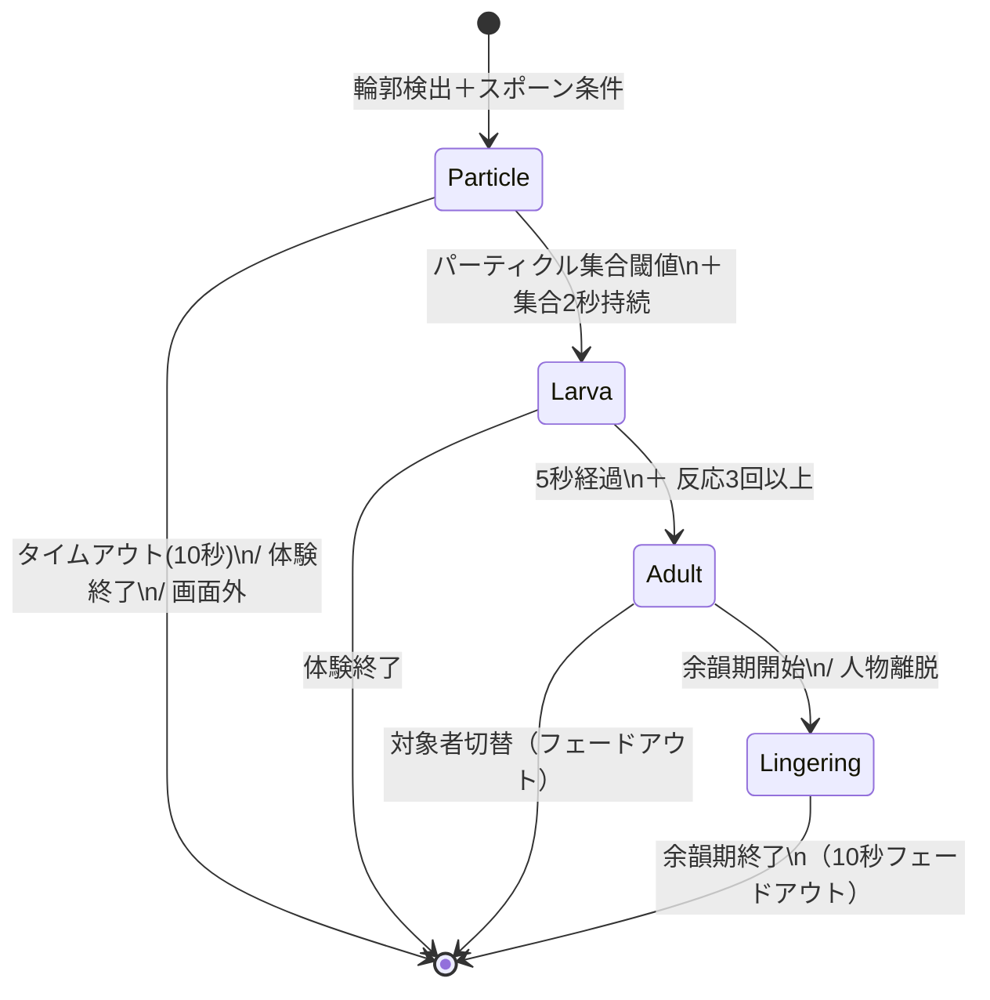
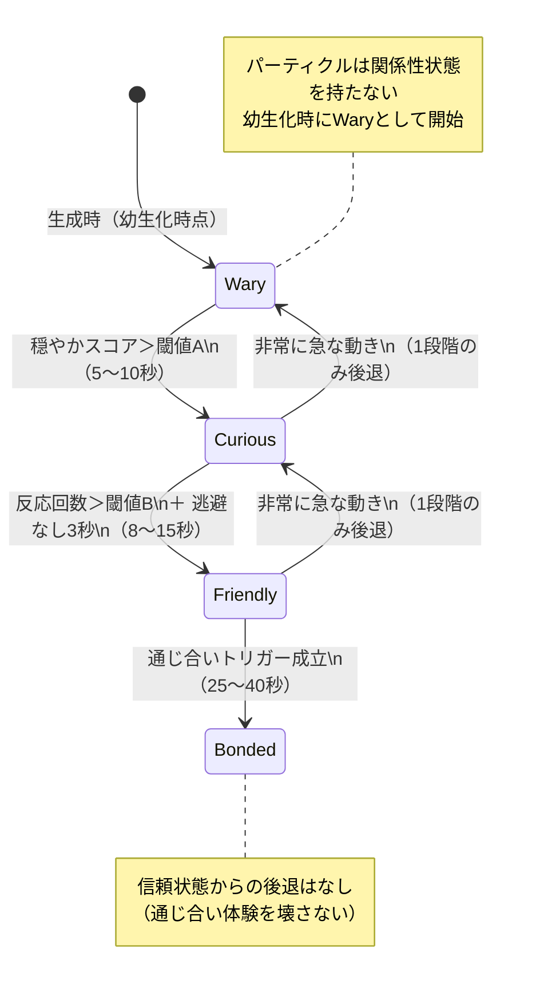
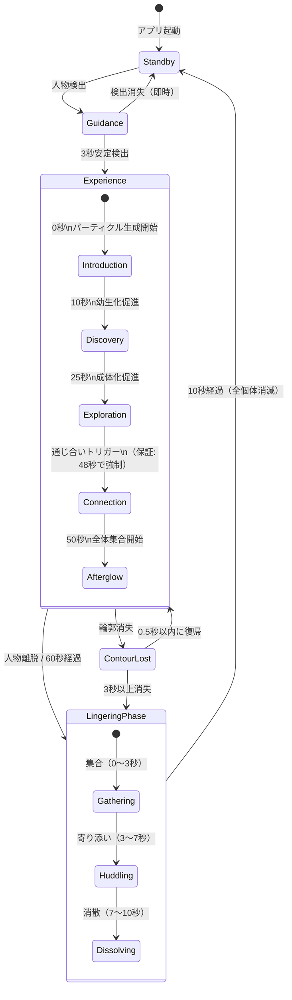

# 生き物行動仕様書

**境界生物 / Liminal Creature**  
バージョン: 1.2 ｜ 作成日: 2026年4月  
変更履歴: v1.0→v1.1 自己レビューによるMECE補完、整合性修正 / v1.1→v1.2 抽象形態方針確定、対象者切替を引き継ぎ方式に変更、複数人対応拡張方針追加

---

## 目次

1. [本書の位置づけ](#1-本書の位置づけ)
2. [生き物の基本定義](#2-生き物の基本定義)
3. [個性パラメータ](#3-個性パラメータ)
4. [形態と成長](#4-形態と成長)
5. [スポーン制御](#5-スポーン制御)
6. [行動ルール](#6-行動ルール)
7. [反応システム（3層構造）](#7-反応システム3層構造)
8. [関係性状態遷移](#8-関係性状態遷移)
9. [体験フェーズ連動](#9-体験フェーズ連動)
10. [通じ合い判定](#10-通じ合い判定)
11. [群れ行動](#11-群れ行動)
12. [異常系・エッジケース処理](#12-異常系エッジケース処理)
13. [入力処理層インターフェース](#13-入力処理層インターフェース)
14. [複数人対応拡張方針](#14-複数人対応拡張方針)
15. [状態遷移図](#15-状態遷移図)
16. [パラメータ一覧](#16-パラメータ一覧)
17. [対応する機能要件マッピング](#17-対応する機能要件マッピング)
18. [未決定事項・設計メモ](#18-未決定事項設計メモ)

---

## 1. 本書の位置づけ

本書は、機能要件一覧における以下のカテゴリの詳細仕様を定義する。

- 4.2 生き物生成系（ID 201〜207）
- 4.3 生き物行動系（ID 301〜311）
- 4.4 通じ合い演出系（ID 401〜406）

画面設計書（SCR-03 体験画面）および体験フロー制御系（ID 801〜807）と連動して読むこと。

### 1.1 用語定義

| 用語 | 定義 |
|------|------|
| エンティティ | 幼生または成体。パーティクルとは区別される。行動ロジック・個性を持つ単位 |
| パーティクル | VFX Graphで描画される個別の粒子。行動ロジックを持たない |
| 描画負荷単位 | パーティクル1個 = 1単位、幼生 = 5単位、成体 = 10単位として換算 |
| 同時描画上限 | NF-104「50体以上」は描画負荷単位で500単位に相当 |

---

## 2. 生き物の基本定義

### 2.1 生き物とは

体験者の輪郭線上から生成されるデジタルエンティティ。パーティクル群として発生し、時間経過と体験者の関与に応じて「幼生」→「成体」へ成長する。

### 2.2 ライフサイクル

| 状態 | 出現条件 | 消滅条件 |
|------|----------|----------|
| パーティクル | 輪郭検出開始＋スポーン条件成立 | 幼生へ統合 / タイムアウト（10秒） / 体験終了 |
| 幼生 | パーティクルが閾値数集合＋持続時間経過 | 成体へ成長 / 体験終了 |
| 成体 | 成長時間経過＋体験者関与条件充足 | 余韻期終了後フェードアウト |
| 余韻中 | 余韻期に遷移 | 10秒かけてフェードアウト後消滅 |

### 2.3 生成上限

| パラメータ | デフォルト値 | 調整範囲 | 描画負荷単位 |
|-----------|------------|---------|------------|
| 同時パーティクル数上限 | 200 | 50〜400 | 200単位 |
| 同時幼生数上限 | 5 | 2〜8 | 25単位 |
| 同時成体数上限 | 3 | 1〜5 | 30単位 |
| **合計描画負荷上限** | **500単位** | — | NF-104準拠 |

> **v1.1修正**: パーティクル上限を500→400に、幼生上限を10→8に変更し、最大同時設定時でも描画負荷上限500単位を超えないよう整合性を確保。

---

## 3. 個性パラメータ

生成時にランダムに決定され、体験中は不変。行動ルール内の各種閾値・係数を変調する。

### 3.1 パラメータ定義

| パラメータ | 範囲 | 影響先 |
|-----------|------|--------|
| **好奇心** (curiosity) | 0.0〜1.0 | 体験者への接近距離、新しい動きへの反応強度 |
| **臆病さ** (timidity) | 0.0〜1.0 | 急な動きへの逃避距離、警戒状態の持続時間 |
| **社交性** (sociability) | 0.0〜1.0 | 他の生き物との距離、群れ形成傾向 |
| **活発さ** (energy) | 0.0〜1.0 | 移動速度、自発的動作の頻度 |

### 3.2 個性の生成ルール

- 各パラメータは正規分布（平均0.5、標準偏差0.2）で生成し、0.0〜1.0にクランプ
- 極端な個体（全パラメータ＞0.8 または ＜0.2）が出た場合は再生成
- 体験ごとに少なくとも1体は好奇心≧0.6の個体を保証する（通じ合いの到達性担保）

### 3.3 個性の行動変調

行動の基本値に対し、個性パラメータで乗算・加算する。

```
実効接近距離 = 基本接近距離 × (1.0 - curiosity × 0.5)
実効逃避速度 = 基本逃避速度 × (0.5 + timidity × 0.5)
自発動作間隔  = 基本間隔 × (1.5 - energy × 1.0)
群れ結合重み  = 基本結合重み × (0.5 + sociability × 1.0)
```

---

## 4. 形態と成長

### 4.1 形態段階

| 段階 | 視覚表現 | サイズ目安 | 出現タイミング |
|------|---------|-----------|-------------|
| パーティクル | 発光する小さな点の集合 | 2〜5px | 導入期（0〜10秒） |
| 幼生 | 粒子がまとまった半透明の塊、脈動あり | 15〜30px | 発見期（10〜25秒） |
| 成体 | 輪郭を持つ有機的な形態、触手/ひれ的な付属物 | 30〜80px | 探索期以降（25秒〜） |

### 4.2 形態バリエーション（ID 206）

個性パラメータに基づき、成体の外見に差異を持たせる。

| 個性傾向 | 形態特徴 | 動き特徴 |
|---------|---------|---------|
| 好奇心高 | 大きな「目」的な発光部、長い触角状の突起 | 伸びるように前方へ傾く |
| 臆病高 | 殻状の外殻、コンパクトな体型 | 丸まる動作が多い |
| 活発高 | 長いひれ/尾、流線型 | 軌跡が長く残る |
| 社交性高 | 複数の小さな発光点を持つ | 他個体の方向へ小さな光を放つ |

> **詳細な視覚仕様は視覚デザインガイドで定義予定。** ここでは行動に影響する形態特徴のみ記述。

### 4.3 成長条件

パーティクル→幼生:
- 同一輪郭領域（半径30px以内）に一定数（8〜12個）のパーティクルが集合
- 集合状態が2秒以上持続

幼生→成体:
- 幼生として5秒以上経過
- 体験者の動きに対して3回以上の反応実行済み
- （上記2条件のAND）

### 4.4 成長と体験フェーズの関係

成長は体験フェーズの進行に緩やかに同期するが、厳密にロックはしない。フェーズ管理側から「成長促進イベント」を発行し、成長条件の閾値を一時的に緩和することで自然な進行を担保する。

---

## 5. スポーン制御

> **v1.1追加**: v1.0で欠落していたスポーン位置ロジック（ID 201）を独立章として追加。

### 5.1 スポーン位置の選定

パーティクルは輪郭線上の特定の位置から生成される。位置は以下の優先度で選定:

| 優先度 | スポーン位置 | 理由 |
|--------|-----------|------|
| 1 | 輪郭の曲率が高い箇所（肩、指先、頭頂部） | 視覚的に自然。体験者が「自分の身体から生まれている」と認識しやすい |
| 2 | 動きのある輪郭領域 | 体験者の動作と生成の因果関係が明確 |
| 3 | 既存パーティクルから離れた箇所 | 輪郭全体に分布させ、視覚的偏りを防ぐ |

### 5.2 スポーン位置の算出

```
1. 輪郭点列から曲率を算出（隣接点の角度変化）
2. 曲率の高い点に重みを付与（weight = curvature^2）
3. 動きのある領域に追加重み（weight += motionMagnitude × 0.5）
4. 既存パーティクル密度が高い領域の重みを減衰（weight × max(0.1, 1.0 - density)）
5. 重み付き確率分布からサンプリングしてスポーン位置決定
```

### 5.3 スポーンレート制御

| フェーズ | スポーンレート | 説明 |
|---------|-------------|------|
| 導入期 | 20個/秒 | 輪郭全体から均一に |
| 発見期 | 10個/秒 | 動きのある箇所に集中 |
| 探索期 | 5個/秒 | 消失補充程度 |
| 通じ合い期 | 0個/秒 | 新規生成停止 |
| 余韻期 | 0個/秒 | 新規生成停止 |

---

## 6. 行動ルール

### 6.1 行動の優先度

高い順に評価し、最も優先度の高い行動を実行する。

| 優先度 | 行動カテゴリ | 例 |
|--------|------------|-----|
| 1（最高） | 緊急反応 | 急な動きへの驚き逃避 |
| 2 | 通じ合い演出 | 寄り添い、注目、特別反応 |
| 3 | 関係性行動 | 接近、回避、観察 |
| 4 | 適応反応 | 慣れ、興味 |
| 5 | 自律行動 | 遊泳、探索、休息 |
| 6（最低） | 輪郭追従 | 輪郭に沿った基本移動 |

### 6.2 基本移動（ID 301）

生き物は常に輪郭との相対位置を意識して移動する。

| 関係性状態 | 輪郭との距離 | 移動パターン |
|-----------|------------|------------|
| 警戒 | 輪郭上〜10px以内 | 輪郭に密着して這うように移動 |
| 興味 | 10〜50px | 輪郭から離れたり戻ったりを繰り返す |
| 親近 | 10〜60px（自由度高） | 活発に泳ぎ回り、時折輪郭に戻る |
| 信頼 | 0〜80px（最も自由） | 輪郭から離れて自由に泳ぎ、寄り添うように戻る |

移動には必ずイージング（Smooth Damp）を適用し、機械的な動きを避ける。

### 6.3 方向性と「見る」動作の定義

> **v1.1追加**: 複数箇所で参照される「見る」動作の正式定義。  
> **v1.2更新**: 抽象形態を前提とした方向性表現に変更。「目」等の具象的な器官は持たない。

生き物は「前方」の概念を持つが、具象的な顔や目は持たない。方向性は動き・形状変化・発光パターンによって暗示的に伝える。

| 要素 | 実装方針 |
|------|---------|
| 前方の決定 | 移動方向 = 前方。静止時は最後の移動方向を維持 |
| 「見る」動作 | 前方を対象に向けて回転（5〜15度/フレーム）＋ 対象側の輪郭がわずかに伸びる変形 |
| 視覚的な手がかり | 具体的な手法は要検討。候補: (a) 移動方向側への形状の非対称な伸長、(b) 前方側の発光濃度の偏り、(c) 軌跡の形状（進行方向が尾を引く）、(d) 脈動リズムの方向的な伝播 |
| 「注目」動作 | 「見る」＋ 一時的な移動停止（0.3〜0.5秒）＋ 全体の輝度上昇 |

> **要検討**: 抽象形態で「どちらを向いているか」を体験者に直感的に伝える方法は、プロトタイプで複数案を比較検証する必要がある。視覚デザインガイドで候補を絞り、ユーザーテストで最終決定。

### 6.4 輪郭追従（ID 303）

- 輪郭上のアンカーポイントを設定し、そこを基準に移動
- アンカーポイントは体験者の動きに伴い輪郭上をスライド
- 複数の生き物が同じアンカーポイントに集中しないよう、最小距離（30px）を保つ
- 輪郭が急変した場合（12.2参照）、アンカーポイントは最近傍の輪郭点にスナップ

### 6.5 静止時行動（ID 308）

体験者が静止している場合（動き検出量＜閾値が2秒以上継続）:

- 成体: ゆっくりと輪郭周辺を周遊、時折体験者の方を「見る」（6.3参照）
- 幼生: 輪郭上で脈動しながら待機
- パーティクル: 輪郭上で緩やかに漂う

### 6.6 画面境界の扱い

> **v1.1追加**

- 生き物は画面内に制約される。画面端に達した場合はソフトバウンダリ（端から50px以内で反発力を受ける）
- 逃避行動中に画面端に到達した場合、輪郭方向への反発力で画面内に戻す
- パーティクルは画面外に出た場合即座に消滅（再生成で補充）

---

## 7. 反応システム（3層構造）

### 7.1 即時反応層（0.1秒以内）

体験者の動きの「変化量」に対して即座に反応する。

| トリガー | 検出方法 | 反応 | 個性変調 |
|---------|---------|------|---------|
| 急な動き（速度＞閾値） | フレーム間の輪郭変位量 | 驚いて散る（逃避） | timidity↑ → 逃避距離増大 |
| ゆっくりした動き | 変位量が中程度 | 興味を示して近づく | curiosity↑ → 接近速度増大 |
| 手を振る | 輪郭の局所的な振動パターン | 追いかける / 一緒に揺れる | energy↑ → 追従速度増大 |
| 静止→動き出し | 静止状態からの遷移検出 | 注目して一瞬止まる→反応 | — |

#### 即時反応の減衰

同じ種類の即時反応が短時間（3秒以内）に連続した場合、反応強度を減衰させる。

```
反応強度 = 基本強度 × max(0.2, 1.0 - 連続回数 × 0.3)
```

### 7.2 適応反応層（数秒スケール）

一定時間内の動きのパターンを蓄積し、適応的に反応を変化させる。

| パターン | 検出方法 | 適応反応 |
|---------|---------|---------|
| 同じ動きの繰り返し | 動き特徴量の類似度（5秒窓） | 慣れ: 反応が穏やかになる |
| 新しい動き | 特徴量が過去パターンと乖離 | 興味: 動きを止めて「注目」（6.3参照）、接近 |
| リズミカルな動き | 周期性検出（7.3参照） | 同期: 動きのリズムに合わせ始める |
| 穏やかな持続 | 低速度が10秒以上持続 | 安心: 接近距離が縮まる |

#### 動き特徴量

以下をフレームごとに算出し、スライディングウィンドウ（5秒 = 150フレーム）で蓄積:

- 輪郭全体の重心移動速度
- 輪郭の面積変化率
- 輪郭の局所的な変形量（上半身/下半身/左右）
- 動きの周期性スコア（7.3で算出）

### 7.3 同期検出の詳細（ID 309）

> **v1.1追加**: v1.0では適応反応層に1行のみだった同期検出を詳細化。

#### 検出ロジック

体験者のリズミカルな動きを検出し、生き物の動きを同期させる。

```
1. 輪郭重心の速度時系列をバッファ（直近5秒分）
2. 速度のピーク（極大値）を検出
3. ピーク間隔の標準偏差を算出
4. 標準偏差 < 閾値（0.15秒） かつ ピーク数 ≧ 4 → リズム検出成立
5. ピーク間隔の平均値 = 体験者のリズム周期
```

#### 同期時の行動

| 条件 | 生き物の反応 |
|------|------------|
| リズム検出成立 | 体験者のリズム周期に合わせて移動速度を脈動させる |
| 同期持続3秒以上 | 発光がリズムに合わせて明滅する |
| 同期持続5秒以上 | 関係性スコアにボーナス（+0.05/秒）。通じ合いへの有力経路 |

#### 同期解除

体験者のリズムが崩れた場合（ピーク間隔の標準偏差＞閾値が1秒継続）、同期状態を解除し通常行動に戻る。解除は段階的（1秒かけてフェードアウト）。

### 7.4 関係性反応層（体験全体スケール）

体験開始からの累積的な関係性を管理する。詳細は次章。

---

## 8. 関係性状態遷移

### 8.1 関係性状態の定義

各生き物（幼生・成体）は体験者に対して個別の関係性状態を持つ。パーティクルは関係性を持たない。

| 状態 | 説明 | 行動特徴 |
|------|------|---------|
| **警戒** (Wary) | 初期状態。体験者を未知の存在として警戒 | 輪郭に張り付く、急な動きで大きく逃げる、自ら近づかない |
| **興味** (Curious) | 体験者に興味を持ち始める | 輪郭から少し離れて観察、動きに追従し始める、時折近づく |
| **親近** (Friendly) | 体験者を安全な存在と認識 | 自由に泳ぎ回る、動きに積極的に反応、遊ぶような行動 |
| **信頼** (Bonded) | 通じ合いの関係。最終到達状態 | 体験者の近くに留まる、動きに寄り添う、特別な反応を見せる |

### 8.2 遷移条件

| 遷移 | 条件 | 所要時間目安 |
|------|------|------------|
| 警戒→興味 | 穏やかな動き累積スコア＞閾値A | 5〜10秒 |
| 興味→親近 | 体験者の動きへの反応回数＞閾値B かつ 急な逃避が3秒以上なし | 8〜15秒 |
| 親近→信頼 | 通じ合いトリガー成立（10章参照） | 25〜40秒 |
| 任意→警戒 | 非常に急な動き（速度＞閾値C）が発生 | 即時（ただし1段階のみ後退） |

> **制約**: 信頼(Bonded)状態からの後退はなし。通じ合い体験を壊さないための設計判断。

### 8.3 遷移スコアの算出

各生き物は「関係性スコア」（0.0〜1.0）を持ち、連続的に変化する。状態はスコアの区間で決定。

```
関係性スコアの更新（毎フレーム）:
  if 穏やかな動き:
    score += 増加レート × curiosity × dt
  if 急な動き:
    score -= 減少レート × timidity × dt
  if 静止状態:
    score += 微増レート × dt  （安心による微増）
  if 同期状態:
    score += 同期ボーナス × dt  （v1.1追加）

  score = clamp(score, 0.0, 1.0)

状態判定:
  score < 0.25  → 警戒
  score < 0.50  → 興味
  score < 0.75  → 親近
  score >= 0.75 → 信頼
```

### 8.4 個性による遷移速度の差

- 好奇心が高い個体 → 関係性スコアの増加レートにボーナス（×1.5）
- 臆病な個体 → 急な動きによる減少ペナルティが大きい（×1.5）
- これにより、好奇心の高い個体が先に信頼状態に到達し、「通じ合い」の先導役となる

---

## 9. 体験フェーズ連動

体験フローコントローラ（ID 804）から発行されるフェーズ遷移イベントに応じて、行動パラメータを調整する。

### 9.1 フェーズ別パラメータ補正

| パラメータ | 導入期 | 発見期 | 探索期 | 通じ合い期 | 余韻期 |
|-----------|--------|--------|--------|-----------|--------|
| 生成速度 | 高(20/秒) | 中(10/秒) | 低(5/秒) | 停止 | 停止 |
| 成長速度補正 | ×0.5 | ×1.0 | ×1.5 | ×1.0 | ×1.0 |
| 即時反応強度 | ×0.5 | ×1.0 | ×1.2 | ×0.8 | ×0.3 |
| 関係性スコア増加ボーナス | なし | なし | なし | ×2.0 | なし |
| 移動速度上限 | ×0.5 | ×1.0 | ×1.3 | ×0.8 | ×0.4 |
| 輪郭からの最大距離 | 20px | 50px | 80px | 60px | 30px |

> **v1.1修正**: 「高/中/低/小」等の曖昧な表記を具体値に置き換え。

### 9.2 フェーズ遷移時の演出トリガー

| 遷移 | 生き物側の反応 |
|------|--------------|
| 導入→発見 | パーティクルが一斉に集合を始める |
| 発見→探索 | 幼生が成体へ成長を開始、動きが活発化 |
| 探索→通じ合い | 最も関係性スコアの高い個体が「注目」動作（6.3参照）を開始 |
| 通じ合い→余韻 | 全生き物が緩やかに輪郭近くへ集合、動きが穏やかに |

---

## 10. 通じ合い判定

### 10.1 概要

「通じ合い」は本作品の最重要瞬間であり、体験者と生き物が「通じ合った」と感じる演出のトリガーとなる。

### 10.2 トリガー条件（AND）

以下のすべてが成立した場合に通じ合いトリガーを発行:

1. **時間条件**: 体験開始から25秒以上経過（探索期以降）
2. **関係性条件**: 少なくとも1体の生き物が関係性スコア≧0.7
3. **動き条件**: 体験者の動きが「穏やか」状態で2秒以上継続中
4. **未発動条件**: 当該体験中にまだ通じ合いが未発動

### 10.3 通じ合い発動時の行動変化

通じ合いトリガーが発行されると:

| 対象 | 行動変化 | 持続時間 |
|------|---------|---------|
| トリガー個体（最高スコア） | 体験者の正面に移動し「見つめる」動作（6.3参照）、特別な発光 | 5秒 |
| 他の成体 | 動きを止めてトリガー個体の方を「見る」 → 体験者に近づく | 3秒遅延で開始 |
| 幼生 | 興奮して脈動が加速 → 急速に成体へ成長 | 即時 |
| パーティクル | 輪郭から離れてトリガー個体の周囲に集合 | 2秒 |

### 10.4 通じ合いの保証メカニズム

1分間の体験で通じ合いに到達できないと体験が不完全になるため、以下のフェイルセーフを設ける:

| 時刻 | アクション | 説明 |
|------|----------|------|
| 30秒経過 | スコア増加レート ×1.5 | 早期の軽いブースト（v1.1変更） |
| 40秒経過 | スコア増加レート ×3.0 | 強いブースト |
| 48秒経過 | 強制発動 | 最高スコア個体を信頼状態に遷移（v1.1変更: 50秒→48秒） |

> **v1.1修正**: v1.0ではブースト開始が40秒、強制発動が50秒で、ブーストが効く時間が10秒しかなく短すぎた。30秒で軽いブースト開始、48秒で強制発動に変更し、余韻期（50-60秒）に自然に移行する余裕を確保。

保証メカニズム発動時でも、演出の質は通常の通じ合いと同一にし、体験者に違和感を与えない。

---

## 11. 群れ行動

### 11.1 群れの基本ルール（ID 302）

生き物間にはBoids的な相互作用を適用する。ただし、体験者の輪郭との関係が最優先。

| ルール | 説明 | 重み |
|--------|------|------|
| 分離 (Separation) | 近すぎる個体から離れる | 高 |
| 整列 (Alignment) | 近隣個体と移動方向を揃える | 中 |
| 結合 (Cohesion) | 群れの重心に向かう | 低 |
| 輪郭引力 | 体験者の輪郭に引き寄せられる | 最高（関係性に応じて変動） |

### 11.2 sociabilityによる変調

- sociability高 → 結合・整列の重み増加、分離距離縮小
- sociability低 → 分離の重み増加、単独行動傾向

### 11.3 生き物間の相互作用（ID 310）

- 成体同士が近接（20px以内）すると「交流」動作（互いに回り合う）
- 関係性状態の異なる個体がいる場合、信頼状態の個体が警戒状態の個体を「導く」（接近を促す動き）

---

## 12. 異常系・エッジケース処理

> **v1.1追加**: v1.0では完全に欠落していた章。

### 12.1 輪郭検出消失・フリッカー

| 状況 | 判定条件 | 生き物の挙動 |
|------|---------|------------|
| 短時間消失（フリッカー） | 検出消失が0.5秒未満 | 生き物は最後の輪郭位置を記憶して待機。関係性スコアは保持 |
| 中時間消失 | 0.5秒〜3秒 | 生き物は徐々に減速して漂流。関係性スコアは凍結（増減なし） |
| 長時間消失 | 3秒以上 | 体験終了と判定。余韻状態に遷移（SCR-04へ） |

### 12.2 輪郭の急激な変化

セグメンテーション精度の問題により、輪郭が1フレームで大きく変化する場合がある。

- 輪郭の重心移動量が画面幅の20%を超えた場合、「輪郭ジャンプ」と判定
- 輪郭ジャンプ時: 生き物はジャンプ先に瞬間移動せず、1秒かけて新しい輪郭に追従（補間移動）
- ジャンプ発生は即時反応のトリガーとしない（誤反応防止）

### 12.3 対象者切替（ID 807）

> **v1.1追加, v1.2更新**: 生き物を次の対象者に引き継ぐ方式に変更。

対象者選定ロジック（入力処理層）が対象者を切り替えた場合:

| 切替シナリオ | 生き物の挙動 |
|------------|------------|
| 対象者A離脱 → 対象者Bに切替 | 既存の生き物はBの輪郭に向かって移動（2秒かけて遷移）。関係性スコアは1段階後退（例: 親近→興味）して引き継ぐ |
| 対象者A離脱 → 誰もいない | 余韻状態に遷移（12.5参照）。次の対象者が現れた場合、余韻中の個体は新しい輪郭に向かい、警戒状態で再開 |
| 複数人がいる状態で対象者Aが安定 | 非対象者の輪郭近くにいる生き物は緩やかに対象者の輪郭に引き戻される |

#### 引き継ぎ時の挙動詳細

```
1. 新対象者の輪郭を取得
2. 各生き物のアンカーポイントを新輪郭上の最近傍点に再設定
3. 2秒かけて新アンカーポイントへ補間移動（SmoothDamp）
4. 移動中は即時反応を無効化（遷移中の誤反応防止）
5. 関係性スコアを 0.8倍 に減衰（状態が変わらない場合もあるが、閾値付近なら後退する）
6. 到着後、通常の行動ループを再開
```

> **設計判断**: 生き物を引き継ぐことで、展示全体を通じて生き物が「育っていく」感覚を演出できる。一方、長時間の展示で生き物の状態が偏る可能性があるため、手動リセット機能を用意する。

#### 手動リセット（ホットキー）

| 操作 | 効果 |
|------|------|
| リセットキー（管理画面で設定可能、デフォルト: F5） | 全生き物を即座にフェードアウト（0.5秒）→ 新規スポーン開始。関係性スコア全リセット |
| ソフトリセットキー（デフォルト: F6） | 関係性スコアのみリセット（全個体を警戒状態に戻す）。生き物自体は維持 |

### 12.4 パフォーマンス低下時

FPSが30fps以下に低下した場合:

1. パーティクル生成レートを50%に削減
2. 群れ行動の更新頻度を半分に（2フレームに1回）
3. 適応反応層のウィンドウサイズを縮小（5秒→3秒）
4. それでも回復しない場合、パーティクル上限を一時的に50%に削減

### 12.5 余韻状態の行動詳細

> **v1.1追加**: v1.0で不足していた余韻中の行動ルール。

体験終了（人物離脱 or 60秒経過）から余韻画面（SCR-04）への遷移時:

| 時間（余韻開始から） | 行動 |
|--------------------|------|
| 0〜3秒 | 全生き物が最後の輪郭位置に向かって集合。動きは緩やか |
| 3〜7秒 | 集合した位置で互いに寄り添い、穏やかに脈動。群れとして一体的に漂う |
| 7〜10秒 | 個体が一体ずつ順にフェードアウト（最初に生まれた個体から）。パーティクルに還って散る |
| 10秒〜 | 全個体消滅。待機画面（SCR-01）に遷移 |

---

## 13. 入力処理層インターフェース

> **v1.1追加**: 行動システムが入力処理層から受け取るデータの契約定義。

### 13.1 入力データ構造（毎フレーム提供）

```
InputData {
  // 対象者情報
  targetDetected: bool              // 対象者が検出されているか
  targetConfidence: float           // 検出信頼度 (0.0〜1.0)

  // 輪郭データ
  contourPoints: Vector2[]          // 輪郭点列（時計回り、正規化座標0.0〜1.0）
  contourCurvatures: float[]        // 各点の曲率
  contourSmoothed: bool             // 平滑化処理済みフラグ

  // 動きデータ
  motionCentroidDelta: Vector2      // 重心の前フレームからの変位
  motionSpeed: float                // 重心の移動速度（px/秒）
  motionAreaChangeRate: float       // 輪郭面積の変化率
  motionLocalDeformations: float[4] // 局所変形量 [上/下/左/右]

  // メタ情報
  frameTimestamp: double            // フレームのタイムスタンプ
  targetSwitched: bool              // 対象者が切り替わったフレームか
  nonTargetCount: int               // 非対象者の人数
}
```

### 13.2 行動システムからの出力（レンダリング層へ）

```
CreatureRenderData {
  id: int
  position: Vector2
  rotation: float                   // 前方の角度
  scale: float
  formStage: enum {Particle, Larva, Adult}
  relationshipState: enum {Wary, Curious, Friendly, Bonded}
  glowIntensity: float              // 発光強度 (0.0〜1.0)
  trailPoints: Vector2[]            // 軌跡点列（直近N点）
  animationState: string            // 現在の動作名
  personalityVisual: {              // 形態バリエーション用
    curiosity: float
    timidity: float
    sociability: float
    energy: float
  }
}
```

---

## 14. 複数人対応拡張方針

> **v1.2追加**: 1人対応の設計を維持しつつ、将来の複数人対応に向けた拡張方針を定義。本章は実装フェーズ2（1人版プロトタイプ安定後）で具体化する。

### 14.1 基本方針: ハイブリッド方式

各体験者に所属する生き物群を持ちつつ、体験者同士が近づくと生き物が輪郭間を行き来できるようにする。

```
通常時:
  体験者A ←→ 生き物群α（Aの輪郭に所属）
  体験者B ←→ 生き物群β（Bの輪郭に所属）

接近時（A-B間距離 < 閾値）:
  生き物群α ←→ 体験者A ←→ 体験者B ←→ 生き物群β
              ↑ 境界が開き、生き物が行き来可能に ↑
```

### 14.2 所属と越境

| 概念 | 定義 |
|------|------|
| 所属 (Home) | 生き物が生まれた体験者の輪郭。関係性スコアの計算対象 |
| 越境 (Crossing) | 所属元の輪郭を離れ、別の体験者の輪郭に接触・追従する行動 |
| 境界開放条件 | 2人の体験者の輪郭間の最短距離が閾値（暫定: 100px）以下 |
| 帰巣 | 境界が閉じた（距離が閾値を超えた）場合、所属元の輪郭に戻る |

### 14.3 越境時の行動ルール

| 条件 | 行動 |
|------|------|
| 境界開放＋好奇心高い個体 | 相手の輪郭に向かって探索的に移動。越境の先導役 |
| 越境中 | 相手の輪郭に対しても関係性スコアを蓄積する（別スロット） |
| 越境先で通じ合い条件成立 | 越境先の体験者とも「通じ合い」が成立し得る |
| 境界閉鎖 | 1〜2秒かけて所属元の輪郭に帰巣。越境先の関係性スコアは凍結（リセットしない） |

### 14.4 複数人時の関係性データ構造

1人対応では `生き物 → 体験者` の1対1の関係性スコアだが、複数人対応では `生き物 → 体験者N` のマップに拡張する。

```
// 1人版（現行）
CreatureState {
  relationshipScore: float          // 対象者との関係性
}

// 複数人版（拡張）
CreatureState {
  homeTargetId: int                 // 所属する体験者ID
  relationships: Map<int, float>    // 体験者ID → 関係性スコア
  currentTargetId: int              // 現在追従している体験者ID
  isCrossing: bool                  // 越境中フラグ
}
```

> **設計ポイント**: 1人版の `relationshipScore` は `relationships[homeTargetId]` に対応する。1人版のコードを複数人版に拡張する際、インターフェースの変更を最小限にする。

### 14.5 パフォーマンス上の制約

| 項目 | 1人対応 | 2人対応 | 3人以上 |
|------|--------|--------|--------|
| 描画負荷上限 | 500単位 | 人数で按分（250単位/人） | 要検証 |
| セグメンテーション | MediaPipe 1人分 | MediaPipeマルチ人物（8GB GPUで現実的） | 要検証。代替モデル必要の可能性 |
| 行動更新 | 全個体毎フレーム | 全個体毎フレーム（個体数は減） | 更新頻度の間引きが必要 |

### 14.6 1人版設計への影響

現時点で複数人対応のために1人版の設計を変更する必要はないが、以下の点を実装時に意識する:

| 観点 | 1人版実装時の留意点 |
|------|------------------|
| 関係性スコア | 将来Mapに置き換え可能な構造で実装する（直接フィールドではなくアクセサ経由） |
| アンカーポイント | 「どの輪郭の」アンカーかをIDで管理可能にしておく |
| 通じ合い判定 | 対象者IDを引数に取る形で実装し、複数回呼び出し可能にしておく |
| 入力データ | InputDataに `targetId` を含めておく（1人版では常に0） |

### 14.7 コンセプト上の意味

「境界生物」のコンセプトにおいて、複数人対応は以下の体験を追加する:

- **自分の境界から生まれた生き物が、他者の境界に渡る** — 「自分の一部が他者とつながる」体験
- **他者の生き物が自分の輪郭に来る** — 「他者の一部を受け入れる」体験
- **2人の間の空間を生き物が行き来する** — 「境界が溶ける」瞬間の可視化

> これらは1人版の「通じ合い」を人間同士の関係に拡張するものであり、作品のコンセプトを深化させる方向性として整合する。

---

## 15. 状態遷移図

### 15.1 生き物ライフサイクル



### 15.2 関係性状態遷移



### 15.3 体験フロー全体（生き物行動視点）



---

## 16. パラメータ一覧

管理画面（SCR-05）から実行時調整可能なパラメータ。設定ファイル（JSON）に外部化する。

### 16.1 生成パラメータ

| パラメータ名 | デフォルト | 範囲 | 説明 |
|------------|----------|------|------|
| `spawn.particleRate` | 20/秒 | 5〜50 | パーティクル生成速度 |
| `spawn.maxParticles` | 200 | 50〜400 | パーティクル上限 |
| `spawn.maxLarvae` | 5 | 2〜8 | 幼生上限 |
| `spawn.maxAdults` | 3 | 1〜5 | 成体上限 |
| `spawn.clusterThreshold` | 10 | 5〜20 | 幼生化に必要なパーティクル数 |
| `spawn.clusterDuration` | 2.0秒 | 1.0〜5.0 | 幼生化に必要な集合持続時間 |
| `spawn.clusterRadius` | 30px | 15〜60 | 幼生化判定の集合半径 |

### 16.2 成長パラメータ

| パラメータ名 | デフォルト | 範囲 | 説明 |
|------------|----------|------|------|
| `growth.larvaToAdultTime` | 5.0秒 | 3.0〜10.0 | 成体化の最低経過時間 |
| `growth.requiredReactions` | 3 | 1〜5 | 成体化に必要な反応回数 |

### 16.3 移動パラメータ

| パラメータ名 | デフォルト | 範囲 | 説明 |
|------------|----------|------|------|
| `movement.baseSpeed` | 60px/秒 | 20〜150 | 基本移動速度 |
| `movement.smoothTime` | 0.3秒 | 0.1〜1.0 | SmoothDampの時定数 |
| `movement.contourMinDistance` | 30px | 10〜60 | 個体間の輪郭上最小距離 |
| `movement.screenMargin` | 50px | 20〜100 | 画面端のソフトバウンダリ幅 |

### 16.4 反応パラメータ

| パラメータ名 | デフォルト | 範囲 | 説明 |
|------------|----------|------|------|
| `reaction.suddenThreshold` | 150px/フレーム | 50〜300 | 「急な動き」の閾値 |
| `reaction.calmThreshold` | 20px/フレーム | 5〜50 | 「穏やかな動き」の閾値 |
| `reaction.fleeDistance` | 80px | 30〜200 | 逃避距離 |
| `reaction.fleeDuration` | 0.5秒 | 0.2〜2.0 | 逃避動作の持続時間 |
| `reaction.adaptWindow` | 5.0秒 | 3.0〜10.0 | 適応反応のスライディングウィンドウ |
| `reaction.repeatDecay` | 0.3 | 0.1〜0.5 | 即時反応の連続減衰係数 |

### 16.5 同期パラメータ

> **v1.1追加**

| パラメータ名 | デフォルト | 範囲 | 説明 |
|------------|----------|------|------|
| `sync.peakThresholdStdDev` | 0.15秒 | 0.05〜0.3 | リズム検出の周期安定性閾値 |
| `sync.minPeaks` | 4 | 3〜6 | リズム検出に必要な最低ピーク数 |
| `sync.scoreBonus` | 0.05/秒 | 0.02〜0.1 | 同期持続時の関係性スコアボーナス |
| `sync.fadeOutDuration` | 1.0秒 | 0.5〜2.0 | 同期解除のフェードアウト時間 |

### 16.6 関係性パラメータ

| パラメータ名 | デフォルト | 範囲 | 説明 |
|------------|----------|------|------|
| `relationship.calmIncreaseRate` | 0.02/秒 | 0.01〜0.05 | 穏やかな動き時のスコア増加 |
| `relationship.suddenDecreaseRate` | 0.1/回 | 0.05〜0.3 | 急な動き時のスコア減少 |
| `relationship.idleIncreaseRate` | 0.005/秒 | 0.001〜0.01 | 静止時のスコア微増 |
| `relationship.waryThreshold` | 0.25 | — | 警戒→興味の境界 |
| `relationship.curiousThreshold` | 0.50 | — | 興味→親近の境界 |
| `relationship.friendlyThreshold` | 0.75 | — | 親近→信頼の境界 |

### 16.7 通じ合いパラメータ

| パラメータ名 | デフォルト | 範囲 | 説明 |
|------------|----------|------|------|
| `connection.minTime` | 25秒 | 15〜35 | 通じ合い可能になる最早時刻 |
| `connection.requiredScore` | 0.7 | 0.5〜0.9 | 通じ合いに必要な最低スコア |
| `connection.calmDuration` | 2.0秒 | 1.0〜5.0 | 穏やかな状態の必要持続時間 |
| `connection.earlyBoostTime` | 30秒 | 25〜40 | 軽いブースト開始時刻 |
| `connection.earlyBoostMultiplier` | 1.5 | 1.2〜2.0 | 軽いブースト倍率 |
| `connection.boostTime` | 40秒 | 30〜50 | 強いブースト開始時刻 |
| `connection.boostMultiplier` | 3.0 | 2.0〜5.0 | 強いブースト倍率 |
| `connection.guaranteeTime` | 48秒 | 40〜55 | 強制通じ合い発動時刻 |

### 16.8 群れパラメータ

| パラメータ名 | デフォルト | 範囲 | 説明 |
|------------|----------|------|------|
| `flock.separationWeight` | 1.5 | 0.5〜3.0 | 分離重み |
| `flock.alignmentWeight` | 1.0 | 0.0〜2.0 | 整列重み |
| `flock.cohesionWeight` | 0.5 | 0.0〜2.0 | 結合重み |
| `flock.contourWeight` | 3.0 | 1.0〜5.0 | 輪郭引力重み |
| `flock.neighborRadius` | 60px | 20〜120 | 近隣判定半径 |

### 16.9 異常系パラメータ

> **v1.1追加**

| パラメータ名 | デフォルト | 範囲 | 説明 |
|------------|----------|------|------|
| `resilience.flickerThreshold` | 0.5秒 | 0.2〜1.0 | フリッカー判定の時間閾値 |
| `resilience.lostThreshold` | 3.0秒 | 1.0〜5.0 | 消失→体験終了の時間閾値 |
| `resilience.contourJumpThreshold` | 0.2 | 0.1〜0.4 | 輪郭ジャンプ判定（画面幅比） |
| `resilience.contourJumpSmoothTime` | 1.0秒 | 0.5〜2.0 | ジャンプ時の補間追従時間 |
| `resilience.fpsDropThreshold` | 30 | 20〜40 | パフォーマンス低下判定FPS |
| `resilience.resetKey` | F5 | 任意キー | 全リセットのホットキー |
| `resilience.softResetKey` | F6 | 任意キー | ソフトリセット（関係性のみ）のホットキー |
| `resilience.targetSwitchTransition` | 2.0秒 | 1.0〜3.0 | 対象者切替時の遷移時間 |
| `resilience.targetSwitchScoreDecay` | 0.8 | 0.5〜1.0 | 切替時の関係性スコア減衰率 |

---

## 17. 対応する機能要件マッピング

| 本書の章 | 対応する機能要件ID |
|---------|-----------------|
| 2. 基本定義 | 201, 205 |
| 3. 個性パラメータ | 202, 307 |
| 4. 形態と成長 | 203, 204, 206 |
| 5. スポーン制御 | 201（位置ロジック） |
| 6. 行動ルール | 301, 303, 308 |
| 7. 反応システム | 304, 305, 309 |
| 8. 関係性状態遷移 | 306 |
| 9. 体験フェーズ連動 | 804（体験フロー制御系との連携） |
| 10. 通じ合い判定 | 401, 402, 403, 406 |
| 11. 群れ行動 | 302, 310 |
| 12. 異常系 | 807, 906（自動復帰）, 509（FPS維持） |
| 13. インターフェース | 105, 106（動き検出・分類との契約） |
| 14. 複数人対応拡張方針 | 108, 109（複数人検出・対象者選定の拡張） |

### 未カバーの機能要件

| ID | 機能名 | カバー先 | 備考 |
|----|--------|---------|------|
| 207 | AI形態生成 | 視覚デザインガイド | 任意要件 |
| 311 | 学習・記憶 | 未定義 | 任意要件。痕跡システムと連動する場合は別途定義 |
| 404 | 色調変化 | 視覚デザインガイド | 関係性状態との対応を定義予定 |
| 405 | 音響演出 | 音響仕様 | 行動イベントをトリガーとして提供する設計 |
| 110 | 非対象者処理 | 画面設計書（SCR-03 レイヤー3） | 生き物行動への影響なし（視覚処理のみ） |
| 510 | 非対象者の視覚処理 | 視覚デザインガイド | 同上 |

---

## 18. 未決定事項・設計メモ

> **v1.1追加**

### 18.1 要検討事項

| 項目 | 現在の暫定方針 | 最終決定タイミング |
|------|-------------|----------------|
| 方向性の視覚表現 | 抽象形態で方向性を伝える手法を複数候補で検証（形状変形、発光偏り、軌跡、脈動伝播） | プロトタイプ検証 → 視覚デザインガイド |
| 輪郭ジャンプ閾値の妥当性 | 画面幅の20%（暫定） | MediaPipe実機テスト後 |
| フリッカー閾値 | 0.5秒（暫定） | 展示環境テスト後 |
| 同期検出のFFT vs ピーク間隔 | ピーク間隔方式（実装が軽量） | プロトタイプ検証後 |
| 対象者切替時のスコア減衰率 | 0.8（暫定）。低すぎると引き継ぎ感が薄い、高すぎると新鮮さが損なわれる | ユーザーテスト後 |
| パーティクルのタイムアウト時間 | 10秒 | プロトタイプ検証後 |
| 長時間展示での生き物の偏り | ホットキーによる手動リセットで対応。自動リセット条件（例: N人連続で通じ合い到達後）も要検討 | 展示リハーサル後 |
| 複数人時の境界開放距離 | 100px（暫定） | 2人版プロトタイプで検証 |
| 複数人時の描画負荷按分 | 人数で均等按分（暫定） | パフォーマンステスト後 |
| 越境した生き物の帰巣タイミング | 境界閉鎖時に即帰巣（暫定）。滞在時間に応じた猶予も検討 | ユーザーテスト後 |

### 18.2 次の成果物への申し送り

- **状態遷移図（成果物2）**: 本書15章のMermaid図を正式な状態遷移図として清書・拡充
- **データモデル設計（成果物4）**: 13章のインターフェース定義をUnity C#クラス設計に展開
- **視覚デザインガイド（成果物5）**: 4.2の形態バリエーション、6.3の方向性表現、ID 404色調変化を視覚仕様として確定
- **複数人対応詳細仕様**: 1人版プロトタイプ安定後に14章を具体化。越境時の演出、体験フロー制御（複数人の体験フェーズ独立 or 共有）等を定義

---

*以上*
