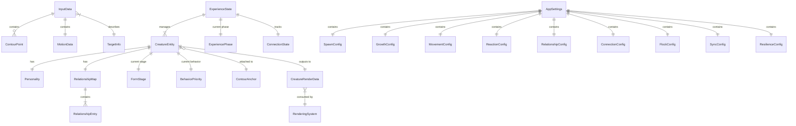
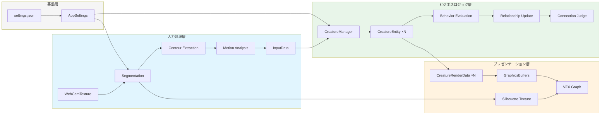

# データモデル設計

**境界生物 / Liminal Creature**  
バージョン: 1.1 ｜ 作成日: 2026年4月  
変更履歴: v1.0→v1.1 MECEレビュー反映（パーティクル管理境界明確化、余韻サブ状態、スポーン候補型、Boids計算型、デバッグ表示型、ダブルバッファリング、GraphicsBufferレイアウト修正等）

---

## 目次

1. [本書の位置づけ](#1-本書の位置づけ)
2. [設計方針](#2-設計方針)
3. [エンティティ関連図](#3-エンティティ関連図)
4. [入力処理層データモデル](#4-入力処理層データモデル)
5. [生き物データモデル](#5-生き物データモデル)
6. [体験フロー制御データモデル](#6-体験フロー制御データモデル)
7. [レンダリングデータモデル](#7-レンダリングデータモデル)
8. [設定データモデル](#8-設定データモデル)
9. [永続化データモデル](#9-永続化データモデル)
10. [イベントデータモデル](#10-イベントデータモデル)
11. [データフローサマリー](#11-データフローサマリー)
12. [対応ドキュメントマッピング](#12-対応ドキュメントマッピング)

---

## 1. 本書の位置づけ

プロジェクト設計資料「今後の成果物」における成果物4「データモデル設計」に相当する。生き物行動仕様書v1.2の13章（入力処理層インターフェース）および技術スタック選定書のC#アーキテクチャ方針を基に、Unityプロジェクト内の全データ構造を定義する。

### 参照ドキュメント

| ドキュメント | 参照箇所 |
|------------|---------|
| 生き物行動仕様書 v1.2 | 13章（インターフェース）、3章（個性）、8章（関係性）、16章（パラメータ） |
| 技術スタック選定書 v1.2.1 | 11章（アーキテクチャ方針）、12章（設定管理） |
| 状態遷移図 v1.1 | STD-01〜STD-06（全状態定義） |

---

## 2. 設計方針

| 方針 | 理由 |
|------|------|
| struct優先 | 生き物データ等の頻繁に更新される値型はstructでGC負荷を軽減（NF-201: 8時間稼働） |
| NativeArray互換 | Burst/Job Systemで処理するデータはblittable型で定義 |
| readonly推奨 | 設定値やフレーム間で不変のデータにはreadonlyを付与 |
| enum明示 | 状態遷移図の各状態をenumで1対1対応させ、図と実装の乖離を防ぐ |
| インターフェース分離 | 層間のデータ受け渡しはインターフェースを経由。直接の型依存を避ける |

### 名前空間構造

```
LiminalCreature
├── Core           # 列挙型、共通データ構造、イベント定義
├── Input          # 入力処理層のデータ型
├── Creatures      # 生き物のデータ型
├── Experience     # 体験フロー制御のデータ型
├── Rendering      # レンダリング出力のデータ型
├── Config         # 設定データ型
└── Persistence    # 永続化データ型
```

---

## 3. エンティティ関連図



---

## 4. 入力処理層データモデル

入力処理層からビジネスロジック層に渡されるデータ。行動仕様書13章に準拠。

### 4.1 InputData

毎フレーム入力処理層から提供されるメインデータ構造。

| フィールド | 型 | 説明 | 更新頻度 |
|-----------|-----|------|---------|
| targetDetected | bool | 対象者が検出されているか | 毎フレーム |
| targetConfidence | float | 検出信頼度 (0.0〜1.0) | 毎フレーム |
| contourPoints | NativeArray\<Vector2\> | 輪郭点列（正規化座標） | 毎フレーム |
| contourCurvatures | NativeArray\<float\> | 各点の曲率 | 毎フレーム |
| contourSmoothed | bool | 平滑化処理済みフラグ | 毎フレーム |
| motion | MotionData | 動きデータ（4.2参照） | 毎フレーム |
| frameTimestamp | double | フレームのタイムスタンプ | 毎フレーム |
| targetSwitched | bool | 対象者が切り替わったフレームか | イベント時 |
| targetId | int | 現在の対象者ID | 変更時 |
| nonTargetCount | int | 非対象者の人数 | 毎フレーム |

> **設計判断**: contourPointsとcontourCurvatureはNativeArrayで管理し、Burst Jobからの書き込みとメインスレッドからの読み取りを安全に行う。フレーム終了時にDispose不要なPersistent割当を使用し、フレーム間で再利用する。

> **v1.1追加 スレッドセーフティ**: InputDataBufferはダブルバッファリングで運用する。入力処理層が「書込バッファ」に書き込み完了後、「読取バッファ」とアトミックにスワップする。ビジネスロジック層は常に「読取バッファ」のみ参照する。これによりBurst Jobの書き込みとメインスレッドの読み取りが競合しない。

### 4.2 MotionData

| フィールド | 型 | 説明 |
|-----------|-----|------|
| centroidDelta | Vector2 | 重心の前フレームからの変位 |
| speed | float | 重心の移動速度（px/秒） |
| areaChangeRate | float | 輪郭面積の変化率 |
| localDeformations | float4 | 局所変形量 [上/下/左/右] |
| isSudden | bool | 急な動きか（速度 > suddenThreshold） |
| isCalm | bool | 穏やかな動きか（速度 < calmThreshold） |
| isIdle | bool | 静止状態か（idleDuration > 閾値） |
| idleDuration | float | 静止継続時間（秒） |
| rhythmDetected | bool | リズミカルな動きが検出されたか |
| rhythmPeriod | float | リズム周期（秒）。rhythmDetected == falseの場合は0 |

> **設計判断**: float4（Mathematics パッケージ）を使用。Burst互換かつSIMD最適化が期待できる。

### 4.3 ContourAnchor

生き物が輪郭上のどの位置に紐づいているかを管理する。

| フィールド | 型 | 説明 |
|-----------|-----|------|
| contourIndex | int | 輪郭点列上のインデックス |
| normalizedPosition | float | 輪郭全長に対する正規化位置 (0.0〜1.0) |
| worldPosition | Vector2 | ワールド座標 |
| curvature | float | アンカー位置の曲率 |
| ownerTargetId | int | どの体験者の輪郭か（複数人対応時） |

---

## 5. 生き物データモデル

### 5.1 CreatureEntity

個々の生き物（幼生・成体）を表す中心的なデータ構造。

| フィールド | 型 | 説明 | 更新頻度 |
|-----------|-----|------|---------|
| id | int | ユニークID（Object Pool管理） | 生成時 |
| formStage | FormStage | 形態段階（Particle/Larva/Adult） | 遷移時 |
| personality | Personality | 個性パラメータ（5.2参照） | 生成時（不変） |
| position | Vector2 | 現在位置 | 毎フレーム |
| rotation | float | 前方の角度（度） | 毎フレーム |
| velocity | Vector2 | 現在の速度ベクトル | 毎フレーム |
| anchor | ContourAnchor | 輪郭上のアンカー | 毎フレーム |
| relationships | RelationshipMap | 体験者との関係性（5.4参照） | 毎フレーム |
| currentBehavior | BehaviorPriority | 現在実行中の行動 | 毎フレーム |
| glowIntensity | float | 発光強度 (0.0〜1.0) | 毎フレーム |
| age | float | 生成からの経過時間（秒） | 毎フレーム |
| reactionCount | int | 反応実行回数（成長条件用） | イベント時 |
| consecutiveReactions | Dictionary\<BehaviorPriority, int\> | 行動種別ごとの連続回数（即時反応減衰用） | イベント時 |
| lastReactionTime | float | 最後に即時反応した時刻（減衰リセット判定用） | イベント時 |
| adaptationBuffer | AdaptationBuffer | 適応反応層のバッファ（5.9参照） | 毎フレーム |
| isActive | bool | アクティブか（Object Pool制御） | プール操作時 |

### 5.2 Personality

生成時に決定され、体験中は不変。

| フィールド | 型 | 範囲 | 説明 |
|-----------|-----|------|------|
| curiosity | float | 0.0〜1.0 | 好奇心 |
| timidity | float | 0.0〜1.0 | 臆病さ |
| sociability | float | 0.0〜1.0 | 社交性 |
| energy | float | 0.0〜1.0 | 活発さ |

> 正規分布（平均0.5、σ0.2）で生成しクランプ。体験ごとに少なくとも1体はcuriosity≧0.6を保証。

### 5.3 FormStage（列挙型）

STD-02に対応。

| 値 | 説明 | 描画負荷単位 | 管理方式 |
|-----|------|------------|---------|
| Particle | パーティクル（行動ロジックなし） | 1 | **VFX Graph管理**。CreatureEntityとしては生成しない。スポーン位置・レートのみC#が制御 |
| Larva | 幼生（基本行動のみ） | 5 | CreatureEntity |
| Adult | 成体（全行動ルール適用） | 10 | CreatureEntity |
| Lingering | 余韻中（フェードアウト中） | 10→0 | CreatureEntity |
| TargetTransition | 対象者切替による遷移中 | 10 | CreatureEntity |

> **設計判断**: パーティクルはVFX Graphのパーティクルシステムで直接管理する。C#側はスポーン位置（曲率ベースの重み付きサンプリング結果）と生成レートのみをVFXに渡す。パーティクルが集合して幼生化する判定のみC#で行い、その時点でCreatureEntityとして生成する。

### 5.4 RelationshipMap

複数人対応を見据え、体験者IDごとに関係性を管理する。1人版では要素数1。

| フィールド | 型 | 説明 |
|-----------|-----|------|
| homeTargetId | int | 所属する体験者ID |
| currentTargetId | int | 現在追従している体験者ID |
| entries | Dictionary\<int, RelationshipEntry\> | 体験者ID → 関係性データ |

### 5.5 RelationshipEntry

| フィールド | 型 | 説明 |
|-----------|-----|------|
| score | float | 関係性スコア (0.0〜1.0) |
| state | RelationshipState | 現在の関係性状態 |
| isFrozen | bool | スコアが凍結中か（越境時） |

> **v1.1注記**: スコアから状態を判定する閾値（0.25/0.50/0.75）はRelationshipConfig（8章）から取得する。ハードコードしない。

### 5.6 RelationshipState（列挙型）

STD-03に対応。

| 値 | スコア範囲 | 説明 |
|-----|----------|------|
| Wary | 0.00〜0.24 | 警戒 |
| Curious | 0.25〜0.49 | 興味 |
| Friendly | 0.50〜0.74 | 親近 |
| Bonded | 0.75〜1.00 | 信頼（不可逆） |

### 5.7 BehaviorPriority（列挙型）

STD-04に対応。

| 値 | 優先度 | 説明 |
|-----|--------|------|
| Emergency | 1（最高） | 緊急反応（逃避） |
| Connection | 2 | 通じ合い演出 |
| Relationship | 3 | 関係性行動 |
| Adaptation | 4 | 適応反応 |
| Autonomous | 5 | 自律行動 |
| ContourFollow | 6（最低） | 輪郭追従 |

### 5.8 CrossingState（列挙型）

STD-05に対応。複数人対応時にのみ使用。

| 値 | 説明 |
|-----|------|
| Home | 所属元の輪郭で活動中 |
| BoundaryAware | 境界開放を認知 |
| Approaching | 越境先に接近中 |
| Crossing | 越境先で活動中 |
| Returning | 帰巣中 |

### 5.9 AdaptationBuffer

適応反応層（行動仕様書7.2章）のスライディングウィンドウデータ。

| フィールド | 型 | 説明 |
|-----------|-----|------|
| speedHistory | NativeRingBuffer\<float\> | 速度履歴（5秒分 = 150サンプル） |
| areaHistory | NativeRingBuffer\<float\> | 面積変化率履歴 |
| deformHistory | NativeRingBuffer\<float4\> | 局所変形履歴 |
| peakIntervals | NativeList\<float\> | 速度ピーク間隔（同期検出用） |
| habituation | float | 慣れレベル (0.0〜1.0) |

> **NativeRingBuffer**: 自前実装のリングバッファ。NativeArrayのラッパーとして、Burst互換で固定サイズ循環バッファを提供する。

### 5.10 SpawnCandidate

> **v1.1追加**: 行動仕様書5章のスポーン位置選定結果。

| フィールド | 型 | 説明 |
|-----------|-----|------|
| contourIndex | int | 輪郭点列上のインデックス |
| position | float2 | ワールド座標 |
| weight | float | スポーン確率の重み（曲率・動き・密度から算出） |
| curvature | float | その位置の曲率 |

C#側で毎フレーム計算し、VFX Graphにスポーン位置として渡す。

### 5.11 BoidsForceData

> **v1.1追加**: Burst Jobで計算するBoids力の入出力型。

| フィールド | 型 | 説明 |
|-----------|-----|------|
| separation | float2 | 分離力 |
| alignment | float2 | 整列力 |
| cohesion | float2 | 結合力 |
| contourAttraction | float2 | 輪郭引力 |
| combined | float2 | 重み付き合成力 |

NativeArray\<BoidsForceData\>としてJob System内で個体ごとに並列計算。

### 5.12 CreaturePoolStats

> **v1.1追加**: Object Poolの管理情報。パフォーマンスモニタ（SCR-06）で表示。

| フィールド | 型 | 説明 |
|-----------|-----|------|
| capacity | int | プールの最大容量 |
| activeCount | int | 現在アクティブな個体数 |
| highWaterMark | int | 過去最大のアクティブ数 |
| spawnCount | int | 累計生成数 |
| despawnCount | int | 累計回収数 |

---

## 6. 体験フロー制御データモデル

### 6.1 ExperienceState

体験全体の状態を管理する。STD-01に対応。

| フィールド | 型 | 説明 |
|-----------|-----|------|
| systemState | SystemState | 現在のシステム状態 |
| phase | ExperiencePhase | 現在の体験フェーズ（Experience中のみ有効） |
| elapsedTime | float | 体験開始からの経過時間（秒） |
| connectionState | ConnectionState | 通じ合い状態（6.3参照） |
| guidanceTimer | float | 誘導画面の安定検出カウンタ（秒） |
| contourLostTimer | float | 輪郭消失からの経過時間（秒） |
| performanceDegraded | bool | パフォーマンス低下状態か |
| lingeringSubState | LingeringSubState | 余韻中のサブ状態（Lingering時のみ有効） |
| lingeringTimer | float | 余韻開始からの経過時間（秒） |

### 6.2 LingeringSubState（列挙型）

> **v1.1追加**: STD-01のLingering内部サブ状態。

| 値 | 時間範囲 | 説明 |
|-----|---------|------|
| Gathering | 0〜3秒 | 最後の輪郭位置に集合 |
| Huddling | 3〜7秒 | 寄り添い・脈動 |
| Dissolving | 7〜10秒 | 個体が順にフェードアウト |

### 6.3 SystemState（列挙型）

STD-01の最上位状態。

| 値 | 対応画面 |
|-----|---------|
| Standby | SCR-01 |
| Guidance | SCR-02 |
| Experience | SCR-03 |
| Lingering | SCR-04 |
| ManualReset | — |
| SoftReset | — |
| ContourFlicker | SCR-03（維持） |
| ContourLost | SCR-03（維持） |
| TargetSwitch | SCR-03（維持） |
| PerfDegraded | SCR-03（維持） |

### 6.4 ExperiencePhase（列挙型）

| 値 | 時間範囲 |
|-----|---------|
| Introduction | 0〜10秒 |
| Discovery | 10〜25秒 |
| Exploration | 25〜40秒 |
| Connection | 通じ合いトリガー〜50秒 |
| Afterglow | 50〜60秒 |

### 6.5 ConnectionState

通じ合い判定の状態管理。

| フィールド | 型 | 説明 |
|-----------|-----|------|
| triggered | bool | 通じ合いが発動済みか |
| triggerCreatureId | int | トリガーとなった生き物のID（-1 = 未発動） |
| boostActive | bool | スコアブースト中か |
| boostMultiplier | float | 現在のブースト倍率 |
| guaranteeForced | bool | 強制発動されたか |

### 6.6 PhaseParameters

フェーズ別のパラメータ補正値。行動仕様書9.1章に対応。

| フィールド | 型 | 説明 |
|-----------|-----|------|
| spawnRate | float | パーティクル生成速度（個/秒） |
| growthMultiplier | float | 成長速度補正 |
| reactionMultiplier | float | 即時反応強度補正 |
| relationshipBonus | float | 関係性スコア増加ボーナス |
| speedMultiplier | float | 移動速度上限補正 |
| maxContourDistance | float | 輪郭からの最大距離（px） |

---

## 7. レンダリングデータモデル

ビジネスロジック層からプレゼンテーション層に渡されるデータ。

### 7.1 CreatureRenderData

行動仕様書13.2章に準拠。毎フレームVFX Graph / Shader Graphに渡される。

| フィールド | 型 | 説明 |
|-----------|-----|------|
| id | int | 生き物ID |
| position | Vector2 | ワールド座標位置 |
| rotation | float | 前方の角度 |
| scale | float | 表示スケール |
| formStage | FormStage | 形態段階 |
| relationshipState | RelationshipState | 関係性状態 |
| glowIntensity | float | 発光強度 (0.0〜1.0) |
| trailPoints | Vector2[] | 軌跡点列（直近N点） |
| animationState | AnimationState | 現在の動作 |
| personality | Personality | 形態バリエーション用 |

### 7.2 AnimationState（列挙型）

| 値 | 説明 |
|-----|------|
| Idle | 待機・漂流 |
| Moving | 通常移動 |
| Fleeing | 逃避中 |
| Approaching | 接近中 |
| Gazing | 注目（「見る」動作） |
| Syncing | リズム同期中 |
| Bonding | 通じ合い演出中 |
| Gathering | 余韻期の集合中 |
| FadingOut | フェードアウト中 |

### 7.3 GraphicsBufferLayout

VFX GraphへのGraphicsBuffer渡しのメモリレイアウト。

| バッファ名 | ストライド | 内容 |
|-----------|----------|------|
| CreaturePositionBuffer | 8 bytes (float2) | [x, y] × maxCreatures |
| CreatureRotationBuffer | 4 bytes (float) | [angle] × maxCreatures |
| CreatureStateBuffer | 16 bytes (int4) | [formStage, relationshipState, animationState, 予約] × maxCreatures |
| CreatureVisualBuffer | 8 bytes (float2) | [glowIntensity, scale] × maxCreatures |
| ActiveCountBuffer | 4 bytes (int) | アクティブな個体数（1要素） |

> **v1.1修正**: glowIntensity, scale, animationStateがバッファレイアウトに欠落していたため追加。trailPointsはGraphicsBufferではなく、個体ごとにLineRenderer or Trail VFXで処理するため本レイアウトには含まない。

### 7.4 DebugDisplayData

> **v1.1追加**: SCR-06（デバッグ画面）で表示するデータの集約型。画面設計書6.8に対応。

| フィールド | 型 | 説明 |
|-----------|-----|------|
| fps | float | 現在のFPS |
| memoryUsageMB | float | メモリ使用量（MB） |
| gpuUsageMB | float | GPU VRAM使用量（MB） |
| inferenceTimeMs | float | 推論時間（ms） |
| detectedPersonCount | int | 検出人数 |
| targetId | int | 対象者ID |
| targetConfidence | float | 検出信頼度 |
| contourPointCount | int | 輪郭点数 |
| activeCreatureCount | int | アクティブ生き物数 |
| creatureStates | (int id, FormStage form, RelationshipState rel)[] | 各生き物の状態サマリー |
| motionLabel | string | 動きの分類ラベル（"穏やか"/"急"/"静止"等） |
| motionSpeed | float | 動き速度 |
| elapsedTime | float | 体験経過時間 |
| currentPhase | ExperiencePhase | 現在のフェーズ |
| connectionTriggered | bool | 通じ合い発動済みか |
| poolStats | CreaturePoolStats | Object Pool統計 |

---

## 8. 設定データモデル

行動仕様書16章のパラメータ一覧をC#データ構造として定義。JSON外部化対象。

### 8.1 AppSettings（ルート）

| フィールド | 型 | JSON パス |
|-----------|-----|----------|
| spawn | SpawnConfig | spawn.* |
| growth | GrowthConfig | growth.* |
| movement | MovementConfig | movement.* |
| reaction | ReactionConfig | reaction.* |
| sync | SyncConfig | sync.* |
| relationship | RelationshipConfig | relationship.* |
| connection | ConnectionConfig | connection.* |
| flock | FlockConfig | flock.* |
| resilience | ResilienceConfig | resilience.* |
| segmentation | SegmentationConfig | segmentation.* |

### 8.2 各Configの構成

行動仕様書16章のパラメータ表と1対1対応。代表例のみ記載。

#### SpawnConfig

| フィールド | 型 | デフォルト | JSONキー |
|-----------|-----|----------|---------|
| particleRate | float | 20 | spawn.particleRate |
| maxParticles | int | 200 | spawn.maxParticles |
| maxLarvae | int | 5 | spawn.maxLarvae |
| maxAdults | int | 3 | spawn.maxAdults |
| clusterThreshold | int | 10 | spawn.clusterThreshold |
| clusterDuration | float | 2.0 | spawn.clusterDuration |
| clusterRadius | float | 30 | spawn.clusterRadius |

#### SegmentationConfig

| フィールド | 型 | デフォルト | JSONキー |
|-----------|-----|----------|---------|
| modelPath | string | "models/selfie_segmenter.onnx" | segmentation.modelPath |
| confidenceThreshold | float | 0.5 | segmentation.confidenceThreshold |
| smoothingStrength | float | 0.5 | segmentation.smoothingStrength |
| inputWidth | int | 256 | segmentation.inputWidth |
| inputHeight | int | 256 | segmentation.inputHeight |

> 全パラメータの詳細は行動仕様書v1.2の16章を参照。C#定義は付属のインターフェース定義ファイルに記載。

---

## 9. 永続化データモデル

### 9.1 CalibrationData

展示現場キャリブレーション（技術スタック選定書14.3章）の保存データ。

| フィールド | 型 | 説明 |
|-----------|-----|------|
| backgroundImagePath | string | 背景基準画像のパス |
| averageBrightness | float | 背景の平均輝度 |
| calibratedAt | string | キャリブレーション日時（ISO 8601） |
| presetName | string | 適用中のプリセット名 |

### 9.2 CreaturePersistence

痕跡・継続系（ID 701, 702）で使用。推奨要件のため、基本構造のみ定義。

| フィールド | 型 | 説明 |
|-----------|-----|------|
| creatureId | int | 生き物ID |
| personality | Personality | 個性パラメータ |
| maxRelationshipScore | float | 到達した最高関係性スコア |
| totalAge | float | 累計生存時間（秒） |
| savedAt | string | 保存日時 |

---

## 10. イベントデータモデル

C# event / Action<T> で通知されるイベントのペイロード。

### 10.1 イベント一覧

| イベント名 | ペイロード型 | 発行元 | 購読者 |
|-----------|------------|--------|--------|
| OnPhaseChanged | PhaseChangedEvent | ExperienceController | CreatureManager, RenderingSystem, AudioManager |
| OnConnectionTriggered | ConnectionTriggeredEvent | ConnectionJudge | CreatureManager, RenderingSystem, AudioManager |
| OnTargetSwitched | TargetSwitchedEvent | InputProcessor | CreatureManager |
| OnTargetLost | TargetLostEvent | InputProcessor | ExperienceController |
| OnCreatureSpawned | CreatureSpawnedEvent | CreatureManager | RenderingSystem |
| OnCreatureFormChanged | FormChangedEvent | CreatureManager | RenderingSystem |
| OnSettingsChanged | SettingsChangedEvent | SettingsManager | 全モジュール |
| OnPerformanceWarning | PerformanceWarningEvent | PerformanceMonitor | CreatureManager, RenderingSystem |

### 10.2 主要イベントペイロード

#### PhaseChangedEvent

| フィールド | 型 | 説明 |
|-----------|-----|------|
| previousPhase | ExperiencePhase | 遷移元フェーズ |
| newPhase | ExperiencePhase | 遷移先フェーズ |
| elapsedTime | float | 体験開始からの経過時間 |
| phaseParameters | PhaseParameters | 新フェーズのパラメータ補正値 |

#### ConnectionTriggeredEvent

| フィールド | 型 | 説明 |
|-----------|-----|------|
| triggerCreatureId | int | トリガーとなった生き物のID |
| targetId | int | 通じ合いが成立した体験者のID |
| wasForced | bool | 保証メカニズムによる強制発動か |
| score | float | トリガー時の関係性スコア |

#### TargetSwitchedEvent

| フィールド | 型 | 説明 |
|-----------|-----|------|
| previousTargetId | int | 前の対象者ID |
| newTargetId | int | 新しい対象者ID |
| creatureCount | int | 引き継ぐ生き物の数 |

#### SettingsChangedEvent

| フィールド | 型 | 説明 |
|-----------|-----|------|
| changedKeys | string[] | 変更されたJSONキーの配列 |
| settings | AppSettings | 更新後の設定全体 |

---

## 11. データフローサマリー

### 11.1 フレームごとのデータフロー



### 11.2 データの所有権

| データ | 所有者 | 読取者 |
|--------|--------|--------|
| InputData | InputProcessor | CreatureManager, ExperienceController |
| CreatureEntity | CreatureManager (Object Pool) | RenderingSystem（RenderData経由） |
| ExperienceState | ExperienceController | CreatureManager, UI |
| AppSettings | SettingsManager | 全モジュール（読取専用） |
| GraphicsBuffers | RenderingSystem | VFX Graph |

---

## 12. 対応ドキュメントマッピング

| 本書の章 | 対応する既存ドキュメント |
|---------|---------------------|
| 4. 入力処理層 | 行動仕様書 13.1章 InputData |
| 5. 生き物 | 行動仕様書 2〜4章、8章、14章 |
| 5.7 BehaviorPriority | 状態遷移図 STD-04 |
| 5.8 CrossingState | 状態遷移図 STD-05 |
| 6. 体験フロー | 状態遷移図 STD-01 |
| 7. レンダリング | 行動仕様書 13.2章 CreatureRenderData、技術スタック 9章 VFX連携 |
| 8. 設定 | 行動仕様書 16章パラメータ一覧、技術スタック 12章設定管理 |
| 10. イベント | 技術スタック 11.4章 Observer/Event パターン |

### 未定義・将来対応

| 項目 | 理由 | 定義タイミング |
|------|------|-------------|
| 音響関連データ | 推奨要件（優先度低） | 音響仕様策定時 |
| AI形態生成データ（ID 207） | 任意要件 | 視覚デザインガイドで方向性確定後 |
| 学習・記憶データ（ID 311） | 任意要件 | 痕跡システム詳細設計時 |

---

*以上*
