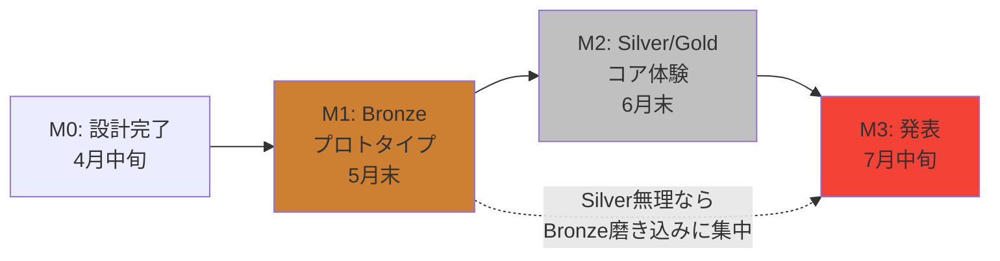
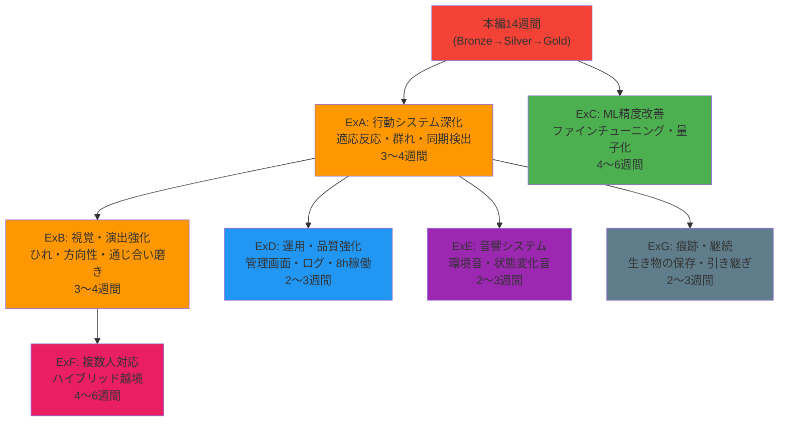

# 開発スケジュール

**境界生物 / Liminal Creature**  
バージョン: 2.0 ｜ 作成日: 2026年4月  
変更履歴: v1.0→v2.0 発表日を2026年7月中旬に修正。全面書き直し（14週間計画）

> **重要**: v1.0では発表日を誤って2027年7月中旬としていた。正しくは**2026年7月中旬**であり、開発期間は約3ヶ月（14週間）である。他の設計ドキュメント（行動仕様書、技術スタック選定書等）に記載の「2027/07中旬発表」も同様に「2026/07中旬」が正しい。

---

## 目次

### Part A: 14週間計画（本編）
1. [前提条件](#1-前提条件)
2. [現実的な評価](#2-現実的な評価)
3. [スコープ定義（14週間版）](#3-スコープ定義14週間版)
4. [全体タイムライン](#4-全体タイムライン)
5. [フェーズ1: 学習＋入力パイプライン（W1〜W3）](#5-フェーズ1-学習入力パイプラインw1w3)
6. [フェーズ2: プロトタイプ（W4〜W6）](#6-フェーズ2-プロトタイプw4w6)
7. [フェーズ3: コア体験構築（W7〜W10）](#7-フェーズ3-コア体験構築w7w10)
8. [フェーズ4: 磨き込み＋安定化（W11〜W12）](#8-フェーズ4-磨き込み安定化w11w12)
9. [フェーズ5: 展示準備（W13〜W14）](#9-フェーズ5-展示準備w13w14)
10. [マイルストーン一覧](#10-マイルストーン一覧)
11. [スコープ調整戦略](#11-スコープ調整戦略)
12. [リスクと対応](#12-リスクと対応)
13. [進捗管理](#13-進捗管理)

### Part B: 拡張開発スケジュール
14. [拡張開発の全体像](#14-拡張開発の全体像)
15. [ExA: 行動システム深化](#15-exa-行動システム深化3〜4週間)
16. [ExB: 視覚・演出強化](#16-exb-視覚演出強化3〜4週間)
17. [ExC: ML精度改善](#17-exc-ml精度改善4〜6週間)
18. [ExD: 運用・品質強化](#18-exd-運用品質強化2〜3週間)
19. [ExE: 音響システム](#19-exe-音響システム2〜3週間)
20. [ExF: 複数人対応](#20-exf-複数人対応4〜6週間)
21. [ExG: 痕跡・継続システム](#21-exg-痕跡継続システム2〜3週間)
22. [拡張開発の総工数見積もり](#22-拡張開発の総工数見積もり)

---

## 1. 前提条件

| 項目 | 内容 |
|------|------|
| 開発開始 | 2026年4月中旬（本週） |
| **発表** | **2026年7月中旬** |
| 開発体制 | 完全一人開発 |
| 週あたり稼働 | 30時間以上 |
| **総開発期間** | **約14週間** |
| **総工数概算** | **30h/週 × 14週 = 約420時間** |
| Unity経験 | 初心者（数ヶ月以下）。学習と実装を並行する |
| PyTorch経験 | ビギナークラス |

### 1.1 420時間の現実

420時間で Unity初心者がインタラクティブアート作品を完成させるのは**挑戦的だが実現可能**である。ただし以下の条件を満たす必要がある:

- スコープを「必須要件の中でもさらに核心部分」に絞る
- 学習と実装を分離せず「作りながら学ぶ」アプローチを取る
- MLファインチューニングは行わない（既存モデルをそのまま使う）
- 視覚表現は「完璧」を目指さず「十分に伝わる」レベルを狙う
- 複数人対応、音響、痕跡は全てスコープ外

---

## 2. 現実的な評価

### 2.1 機能要件の再評価（14週間版）

機能要件一覧の76件を14週間で再評価する。

| 分類 | 件数 | 14週間での扱い |
|------|------|-------------|
| 必須 | 31件 | **核心の20件に集中**。残り11件は簡略化 or 最低限 |
| 重要 | 25件 | **5〜8件を選択実装**。残りはスコープ外 |
| 推奨 | 16件 | **全てスコープ外** |
| 任意 | 4件 | **全てスコープ外** |

### 2.2 14週間で実装する機能（核心20件）

| ID | 機能名 | 優先度 | 理由 |
|----|--------|--------|------|
| 101 | 人物検出 | 必須 | 体験の前提 |
| 102 | セグメンテーション | 必須 | 体験の前提 |
| 103 | 輪郭抽出 | 必須 | 生き物生成の基盤 |
| 105 | 動き検出 | 必須 | 反応の基盤 |
| 108 | 複数人検出 | 必須 | 展示環境で不可避 |
| 109 | 対象者選定 | 必須 | 同上 |
| 110 | 非対象者処理 | 必須 | 同上 |
| 113 | 輪郭平滑化処理 | 必須 | 視覚品質の最低限 |
| 115 | 検出信頼度フィルタ | 必須 | 安定動作に必須 |
| 201 | スポーン制御 | 必須 | 生き物生成 |
| 205 | 生成数制御 | 必須 | パフォーマンス管理 |
| 301 | 基本移動 | 必須 | 生き物の動き |
| 303 | 輪郭追従 | 必須 | 生き物が輪郭にいる |
| 304 | 即時反応 | 必須 | 体験のインタラクション核心 |
| 501 | パーティクル描画 | 必須 | 生き物の視覚化 |
| 506 | 背景描画 | 必須 | カメラ映像表示 |
| 509 | フレームレート維持 | 必須 | 体験の品質 |
| 801 | 待機状態 | 必須 | 展示フロー |
| 802 | 体験開始検出 | 必須 | 同上 |
| 805 | 体験終了検出 | 必須 | 同上 |
| 806 | リセット処理 | 必須 | 同上 |

### 2.3 時間が許せば追加する機能（重要から選択）

| ID | 機能名 | 追加条件 |
|----|--------|---------|
| 202 | 個性パラメータ生成 | W8までにコア完成していれば |
| 204 | 成長システム（Particle→Larva→Adult） | W8までにコア完成していれば |
| 306 | 関係性状態遷移 | W9までに余裕があれば |
| 404 | 色調変化（寒色→暖色） | 306が実装できた場合 |
| 401 | 通じ合いトリガー判定 | 306が実装できた場合 |
| 406 | 寄り添い行動 | 401が実装できた場合 |
| 902 | エラーハンドリング | W11以降の安定化フェーズで |
| 903 | パラメータ調整UI（最小限） | W11以降 |

### 2.4 明示的にスコープ外とするもの

| 項目 | 理由 |
|------|------|
| 複数人対応（ハイブリッド越境） | 1人対応の完成が優先 |
| ファインチューニング（ID 116, 117, 118） | 時間が足りない。既存モデルで勝負 |
| 音響（ID 601〜604） | 推奨要件。視覚が先 |
| 痕跡・継続（ID 701〜704） | 推奨/任意要件 |
| AI形態生成（ID 207） | 任意要件 |
| 学習・記憶（ID 311） | 任意要件 |
| 同期検出（ID 309） | 重要だが複雑。削減対象 |
| 適応反応（ID 305） | 重要だが即時反応で代替可能 |
| 群れ行動（ID 302） | 重要だが個体が少なければ不要 |

---

## 3. スコープ定義（14週間版）

### 3.1 最小限の体験

14週間で確実に実現する「最小限の体験」を定義する。

```
体験者がカメラの前に立つ
  → 自分のシルエットの輪郭から光の粒（パーティクル）が生まれる
  → 手を動かすとパーティクルが反応する（急な動き→逃げる、ゆっくり→近づく）
  → 時間が経つとパーティクルの色が寒色から暖色に変化する（※余裕があれば）
  → 体験者がいなくなるとパーティクルが散って消える
```

この最小限の体験だけでも「自分の境界から何かが生まれ、反応する」というコアコンセプトは伝わる。

### 3.2 目標レベル別の定義

| レベル | 含まれる体験 | 判定 |
|--------|-----------|------|
| **Bronze（最低限・必達）** | パーティクルが輪郭から生まれ、動きに反応する。体験の開始/終了が動く | これがないと展示できない |
| **Silver（目標）** | 上記＋成長システム（パーティクル→幼生→成体）＋関係性の色変化 | ここを目指す |
| **Gold（理想）** | 上記＋通じ合い演出＋個性パラメータ＋寄り添い行動 | 時間が許せば |

---

## 4. 全体タイムライン

```
2026年
  4月後半  ██ W1-W2  フェーズ1: 学習＋入力パイプライン
  5月前半  ██ W3-W4  フェーズ1完了 → フェーズ2: プロトタイプ
  5月後半  ██ W5-W6  フェーズ2: プロトタイプ完成 ★M1
  6月前半  ██ W7-W8  フェーズ3: コア体験構築
  6月後半  ██ W9-W10 フェーズ3完了 ★M2
  7月前半  ██ W11-W12 フェーズ4: 磨き込み＋安定化
  7月中旬  █  W13-W14 フェーズ5: 展示準備 → 発表 ★M3

★M1: プロトタイプ完成（5月末）= Bronze達成
★M2: コア体験完成（6月末）= Silver達成目標
★M3: 発表（7月中旬）= 可能ならGold
```

---

## 5. フェーズ1: 学習＋入力パイプライン（W1〜W3）

**期間**: 3週間  
**目標**: Unityの最低限の操作を身につけ、カメラ→セグメンテーション→輪郭抽出のパイプラインを動かす  
**方針**: チュートリアルを最小限にし「本プロジェクトのコードを書きながら学ぶ」

### 5.1 週次計画

| 週 | 期間 | 午前（学習: 2h） | 午後（実装: 3〜4h） | 成果物 |
|----|------|----------------|-------------------|--------|
| W1 | 4/14〜4/20 | Unity Editor操作。C#スクリプティング基礎（MonoBehaviour, SerializeField）。公式Roll-a-Ballを1日で完了 | プロジェクト作成。フォルダ構成・Git設定。WebCamTextureでカメラ映像を画面に表示 | カメラ映像がUnityで表示される |
| W2 | 4/21〜4/27 | VFX Graph入門（1日で基本を掴む：生成→動き→色→消滅）。MediaPipe Unity Pluginの導入手順を読む | MediaPipe Plugin導入。セグメンテーションマスク取得。マスクを画面に可視化 | セグメンテーションマスクが取得できる |
| W3 | 4/28〜5/4 | Shader Graph入門（Unlitシェーダー、テクスチャ操作の基本） | 輪郭抽出（Marching Squares簡易版）。輪郭点列の可視化（デバッグ描画）。動き検出（重心速度） | 輪郭点列が取得でき、動き（急/穏やか）が判定できる |

### 5.2 学習の方針

| 原則 | 説明 |
|------|------|
| チュートリアルは最大2日 | Roll-a-Ball 1日 + VFX Graph入門 1日。それ以上は実プロジェクトで学ぶ |
| 困ったら公式ドキュメントを引く | 体系的な学習より「必要な時に調べる」スタイル |
| 完璧を求めない | 「動く」が最優先。綺麗なコードは後から |
| AIアシスタントを活用 | Unity/C#の疑問はClaude等に即座に質問し、学習速度を上げる |

### 5.3 フェーズ1完了条件

- [ ] カメラ映像がUnity上に表示される
- [ ] セグメンテーションマスクが取得できる
- [ ] 輪郭点列が抽出できる（精度は問わない）
- [ ] 動きの速度が数値として取得できる

---

## 6. フェーズ2: プロトタイプ（W4〜W6）

**期間**: 3週間  
**目標**: Bronze達成。「パーティクルが輪郭から生まれ、動きに反応する」  

### 6.1 週次計画

| 週 | 期間 | 内容 | 対応ID |
|----|------|------|--------|
| W4 | 5/5〜5/11 | VFX Graphでパーティクル生成。輪郭上のスポーン位置制御（曲率ベースは後回し、まずランダム位置）。カメラ映像の上にAdditiveでパーティクル表示 | 201, 205, 501, 506 |
| W5 | 5/12〜5/18 | 即時反応の実装。急な動き→パーティクルが散る。ゆっくり→パーティクルが近づく。対象者選定（最も大きい人物を選ぶ簡易版） | 304, 108, 109, 110 |
| W6 | 5/19〜5/25 | 体験フロー（待機→体験→余韻）。シルエットエッジの発光（Shader Graph）。統合テスト。バグ修正 | 801, 802, 805, 806, 113, 115 |

### 6.2 プロトタイプ完了条件（★M1: Bronze達成）

- [ ] カメラの前に立つとパーティクルが輪郭から生まれる
- [ ] 手を動かすとパーティクルが反応する
- [ ] 人がいなくなるとパーティクルが消えて待機に戻る
- [ ] 複数人が映っても1人を対象として動作する
- [ ] 30fps以上で動作する

---

## 7. フェーズ3: コア体験構築（W7〜W10）

**期間**: 4週間  
**目標**: Silver達成を目指す。成長システム＋関係性＋色変化。可能ならGoldへ

### 7.1 週次計画

| 週 | 期間 | 内容 | レベル |
|----|------|------|--------|
| W7 | 5/26〜6/1 | CreatureEntity実装。パーティクル集合→幼生化。幼生のVFX描画（脈動する光の塊） | Silver |
| W8 | 6/2〜6/8 | 幼生→成体の成長。成体の描画（単一Quad + SDFの簡易版）。個性パラメータ | Silver |
| W9 | 6/9〜6/15 | 関係性スコア。寒色→暖色の色変化。関係性状態遷移（Wary→Curious→Friendly→Bonded） | Silver→Gold |
| W10 | 6/16〜6/22 | 通じ合い判定＋演出（簡易版）。保証メカニズム。体験フェーズ制御（時間管理） | Gold |

### 7.2 週次の判断ポイント

| 時点 | 判断 |
|------|------|
| W7終了時 | 幼生化ができているか。できていなければW8をパーティクル品質向上に切替え |
| W8終了時 | 成体が表示できているか。できていなければ幼生のみで体験を成立させる方針に切替え |
| W9終了時 | 色変化ができているか。できていなければW10を安定化に切替え（フェーズ4前倒し） |

### 7.3 フェーズ3完了条件（★M2）

**Silver達成:**
- [ ] パーティクル→幼生→成体の成長が動作する
- [ ] 色が関係性に応じて変化する

**Gold達成（ベストケース）:**
- [ ] 通じ合い演出が動作する
- [ ] 保証メカニズム（48秒で強制発動）が動作する

---

## 8. フェーズ4: 磨き込み＋安定化（W11〜W12）

**期間**: 2週間  
**目標**: 展示品質の安定化。見た目の最終調整

### 8.1 週次計画

| 週 | 期間 | 内容 |
|----|------|------|
| W11 | 6/23〜6/29 | 視覚品質の調整。Bloom、色バランス、パーティクルサイズ。パフォーマンスチューニング。明るい環境での視認性テスト |
| W12 | 6/30〜7/6 | 連続稼働テスト（最低2時間）。エラーハンドリング。ウォッチドッグスクリプト。リリースビルド作成。管理者用のパラメータ調整（settings.json手動編集で十分） |

### 8.2 フェーズ4完了条件

- [ ] 2時間以上の連続稼働でクラッシュしない
- [ ] IL2CPPリリースビルドが正常動作
- [ ] 明るい環境（500lux）でパーティクルが視認できる
- [ ] カメラ切断時にエラー画面を表示して待機する

---

## 9. フェーズ5: 展示準備（W13〜W14）

**期間**: 2週間  
**目標**: 展示当日に問題なく稼働する状態

### 9.1 週次計画

| 週 | 期間 | 内容 |
|----|------|------|
| W13 | 7/7〜7/13 | 展示セットアップ手順の確立。キャリブレーション手順。トラブルシューティングリスト作成。可能なら展示環境（または類似環境）でテスト |
| W14 | 7/14〜 | 最終調整。予備日。**発表** |

### 9.2 展示セットアップチェックリスト

| # | 項目 |
|---|------|
| 1 | PCの電源・ディスプレイ接続確認 |
| 2 | Webカメラ接続・角度調整 |
| 3 | アプリ起動確認（フルスクリーン、正しいディスプレイ） |
| 4 | カメラ映像の明るさ確認（必要に応じてsettings.jsonの明度抑制値を調整） |
| 5 | セグメンテーション精度の目視確認（デバッグ表示で輪郭を確認） |
| 6 | パーティクルの視認性確認（Bloom値の調整） |
| 7 | ウォッチドッグスクリプト（watchdog.bat）の動作確認 |
| 8 | 10分間の通し動作確認 |

---

## 10. マイルストーン一覧

| ID | 名称 | 期日 | レベル | 判定基準 |
|----|------|------|--------|---------|
| M0 | 設計完了 | 4月中旬 | — | 本スケジュールまでの全ドキュメント完成 |
| M1 | プロトタイプ完成 | 5月末（W6） | Bronze | パーティクルが輪郭から生まれ反応する |
| M2 | コア体験完成 | 6月末（W10） | Silver/Gold | 成長＋色変化（＋通じ合い） |
| M3 | 発表 | 7月中旬（W14） | — | 展示品質で安定稼働 |



---

## 11. スコープ調整戦略

### 11.1 判断フロー

```
W6終了（5月末）: Bronzeは達成できたか？
  ├── YES → フェーズ3でSilver/Goldを目指す
  └── NO  → フェーズ3をBronze完成に充てる
              Silverは諦めてBronzeの品質を上げる

W10終了（6月末）: Silver/Goldのどこまで到達したか？
  ├── Gold達成 → フェーズ4で磨き込み
  ├── Silver達成 → フェーズ4でSilverの品質を上げる
  └── Bronze止まり → フェーズ4でBronzeを展示品質に
```

### 11.2 「絶対に切らないもの」と「切ってよいもの」

| 絶対に切らない | 理由 |
|--------------|------|
| カメラ→輪郭→パーティクル生成 | これがないと作品が成立しない |
| 動きへの即時反応（逃避/接近） | インタラクションの核心 |
| 体験の開始/終了フロー | 展示として最低限必要 |

| 切ってよい（品質を落としてよい） | 代替 |
|---------------------------|------|
| 成長システム（Particle→Larva→Adult） | パーティクルの大きさ変化で代替 |
| 関係性の色変化 | 時間ベースの色変化で代替（関係性計算なし） |
| 通じ合い演出 | 時間経過で色が暖かくなるだけ |
| 成体のSDF描画 | 大きめの発光パーティクルで代替 |
| 管理画面UI | settings.jsonの手動編集で代替 |
| 個性パラメータ | 全個体同じ挙動で可 |

### 11.3 セグメンテーションモデルの即決方針

14週間ではモデルの比較検証に何週間もかけられない。以下の順で試し、**最初に動いたものを採用する**:

```
1. MediaPipe Unity Plugin (SelfieSegmenter) → W2で導入
   ↓ Unity 6.3で動作しない場合
2. BodyPixSentis (keijiro) → W2後半で導入
   ↓ 精度不足の場合
3. MODNet ONNX → Inference Engine → W3で試行
   ↓ ここまでで決まらない場合は危機的
4. 背景差分（OpenCVなし、シンプルなピクセル差分）→ 最終手段
```

「最初に動いたもので最後まで行く」が原則。精度の微調整は展示前の最後に回す。

---

## 12. リスクと対応

### 12.1 14週間固有のリスク

| リスク | 影響 | 発生時期 | 対応 |
|--------|------|---------|------|
| Unity学習に予想以上に時間がかかる | 全フェーズが遅延 | W1〜W3 | チュートリアルを切り上げて実装に集中。不明点はAIアシスタントに即質問 |
| MediaPipeがUnity 6.3で動作しない | 入力パイプラインが構築できない | W2 | BodyPixSentisに即切替。最悪Unity 2022 LTSにダウングレードも検討 |
| VFX Graphの習得が間に合わない | パーティクル表現が貧弱 | W4 | ParticleSystem（旧システム）で代替。見た目は劣るが動作する |
| 成体のSDF描画が難しすぎる | 成体が表示できない | W8 | 大きなパーティクルの集合体で代替。SDFは諦める |
| 展示環境でセグメンテーション精度が不足 | 輪郭がガタガタ/フリッカー | W13 | 平滑化の強度を上げる。検出信頼度の閾値を上げる（多少の遅延を許容） |
| 連続稼働でクラッシュ | 展示が中断 | W12 | ウォッチドッグスクリプトで自動再起動。5秒で復帰 |

### 12.2 「間に合わない」と判断した場合

W6（5月末）の時点で Bronze すら危うい場合:

1. セグメンテーションを捨て、**背景差分のみで輪郭を取る**（精度は下がるが実装が単純）
2. 成長システムを捨て、**パーティクルのみの作品にする**
3. 関係性・色変化を捨て、**時間経過で色が変わるだけにする**

これでも「自分の輪郭から光の粒が生まれ、動きに反応する」体験は成立する。

---

## 13. 進捗管理

### 13.1 日次管理

| 方法 | 詳細 |
|------|------|
| 日次ログ | 作業内容と時間を1行で記録。例: `W3D2: Marching Squares実装 4h。輪郭は取れたがノイズ多い` |
| Gitコミット | 毎日最低1コミット。動かなくてもWIPコミット |
| 週末レビュー | 30分。今週の実績 vs 計画。来週の調整 |

### 13.2 進捗の測り方

```
Bronze到達率 = 実装済みBronze要件 / Bronze要件総数
  M1時点で100%を目指す

Silver追加率 = 実装済みSilver追加要件 / Silver追加要件総数
  M2時点で100%を目指す（ベストケース）
```

### 13.3 心理的な指針

| 指針 | 説明 |
|------|------|
| 「動くもの」を毎日作る | 設計だけの日を作らない。毎日何かが画面で動く状態にする |
| 完璧を捨てる | 「十分に伝わる」が合格ライン。「美しい」は余裕があれば |
| 詰まったら30分で切り替える | 30分考えて進まなければ、別のアプローチか別のタスクに移る |
| 週1日は休む | 燃え尽きたら終わり。週6日×5時間の方が持続可能 |

---

# Part B: 拡張開発スケジュール

> 以下は、14週間の本編スケジュール完了後（2026年7月中旬以降）、または本編が想定より早く進行した場合に着手する拡張機能の開発計画である。既存の設計ドキュメント（行動仕様書、状態遷移図、データモデル設計等）で詳細設計済みの機能を、優先度順に実装する。

## 14. 拡張開発の全体像

### 14.1 位置づけ

| シナリオ | 拡張の扱い |
|---------|----------|
| 14週間でGold達成＋余裕あり | W11以降で拡張フェーズExA/ExBを前倒し着手 |
| 14週間でSilver止まり | 展示後に拡張開発を継続 |
| 展示後に次の発表機会がある | 拡張スケジュールに沿って段階的に実装 |
| 展示で完結 | 拡張スケジュールは参考資料として保持 |

### 14.2 拡張フェーズ一覧

| フェーズ | 名称 | 期間目安 | 前提 |
|---------|------|---------|------|
| ExA | 行動システム深化 | 3〜4週間 | Silver達成済み |
| ExB | 視覚・演出強化 | 3〜4週間 | ExA完了 |
| ExC | ML精度改善 | 4〜6週間 | Bronze以上で展示済み |
| ExD | 運用・品質強化 | 2〜3週間 | ExA完了 |
| ExE | 音響システム | 2〜3週間 | Silver達成済み |
| ExF | 複数人対応 | 4〜6週間 | ExA + ExB完了 |
| ExG | 痕跡・継続システム | 2〜3週間 | ExA完了 |

```
本編                拡張（展示後 or 前倒し）
W1━━W14 ★発表    ExA━━ExB━━ExC━━ExD━━ExE━━ExF━━ExG
Bronze→Silver→Gold    ↑                              ↑
                    基本の深化                    フル機能完成
```

### 14.3 拡張フェーズの依存関係



> ExCは他のフェーズと独立しており、Python環境での作業が中心。Unity開発と並行して進められる。

---

## 15. ExA: 行動システム深化（3〜4週間）

**前提**: Silver達成済み（成長システム＋関係性が動作している）  
**目標**: 行動仕様書で設計した反応システム・群れ行動を完全実装する

### 15.1 対象機能要件

| ID | 機能名 | 設計ドキュメント参照 |
|----|--------|-----------------|
| 305 | 適応反応 | 行動仕様書 7.2章 |
| 309 | 同期検出 | 行動仕様書 7.3章 |
| 302 | 群れ行動 | 行動仕様書 11章 |
| 307 | 個性行動変調 | 行動仕様書 3.3章 |
| 308 | 静止時行動 | 行動仕様書 6.5章 |
| 310 | 生き物間相互作用 | 行動仕様書 11.3章 |
| 106 | 動き分類 | 行動仕様書 7.2章（動き特徴量） |
| 104 | 輪郭特徴解析 | 行動仕様書 5章（曲率計算精緻化） |

### 15.2 週次計画

| 週 | 内容 | 工数目安 |
|----|------|---------|
| ExA-W1 | AdaptationBuffer実装。スライディングウィンドウでの動き特徴量蓄積。適応反応（慣れ、興味） | 30h |
| ExA-W2 | 同期検出。ピーク間隔ベースのリズム検出。リズム同期時の行動・関係性スコアボーナス | 30h |
| ExA-W3 | 群れ行動（Boids）。Burst Job化。分離・整列・結合・輪郭引力の重み調整 | 30h |
| ExA-W4 | 行動優先度評価（STD-04）の完全実装。個性による行動変調の全パラメータ適用。静止時行動 | 30h |

### 15.3 完了条件

- [ ] 同じ動きを繰り返すと生き物が慣れる（反応が穏やかになる）
- [ ] リズミカルな動きに生き物がリズムを合わせる
- [ ] 複数の生き物が群れとして自然に動く
- [ ] 好奇心の高い個体と臆病な個体で明らかに行動が異なる
- [ ] 静止状態で生き物がゆっくり周遊する

---

## 16. ExB: 視覚・演出強化（3〜4週間）

**前提**: ExA完了  
**目標**: 視覚デザインガイドで定義した演出を完全実装する

### 16.1 対象機能要件

| ID | 機能名 | 設計ドキュメント参照 |
|----|--------|-----------------|
| 502 | 形態描画（成体の完全版） | 視覚デザインガイド 9章 |
| 503 | モーフィング | 視覚デザインガイド 7.3章（集合→幼生化） |
| 504 | 発光エフェクト | 視覚デザインガイド 14.1章 |
| 505 | 軌跡描画 | 視覚デザインガイド 14.2章 |
| 507 | 色彩システム | 視覚デザインガイド 11章（完全版） |
| 508 | シェーダーエフェクト | 視覚デザインガイド 19章 |
| 510 | 非対象者の視覚処理 | 視覚デザインガイド 16章 |
| 206 | 形態バリエーション | 視覚デザインガイド 9.2章 |

### 16.2 週次計画

| 週 | 内容 | 工数目安 |
|----|------|---------|
| ExB-W1 | 成体SDF描画の完全版。コア＋ひれ構造。個性による形態バリエーション | 30h |
| ExB-W2 | 方向性表現の検証（4手法）と決定。注目動作の視覚表現。軌跡描画（Trail VFX） | 30h |
| ExB-W3 | 通じ合い演出の完全版（12章タイムライン）。環境パーティクルとの連動。余韻のパーティクル分解 | 30h |
| ExB-W4 | 非対象者の減光処理。待機画面のプリセットアニメーション。全体の視覚品質調整 | 30h |

### 16.3 完了条件

- [ ] 成体がコア＋ひれの構造で描画され、ひれが流動的に動く
- [ ] 個性パラメータに応じて成体の外見が異なる
- [ ] 方向性（「どちらを向いているか」）が視覚的にわかる
- [ ] 通じ合い演出が完全版のタイムライン通りに実行される
- [ ] 非対象者の領域が適切に暗転される

---

## 17. ExC: ML精度改善（4〜6週間）

**前提**: Bronze以上で展示済み（どのモデルを使ったかのベースラインがある）  
**目標**: 技術スタック選定書16章のMLパイプラインを実行し、セグメンテーション精度を改善する  
**環境**: Python（Unity開発と並行可能）

### 17.1 対象機能要件

| ID | 機能名 | 設計ドキュメント参照 |
|----|--------|-----------------|
| 111 | セグメンテーション精度検証 | 技術スタック選定書 16.7章 |
| 112 | 代替モデル実装 | 技術スタック選定書 7.2章 |
| 114 | 背景キャリブレーション | 技術スタック選定書 14.3章 |
| 116 | 学習データ収集 | 技術スタック選定書 16.5章 |
| 117 | ファインチューニング実施 | 技術スタック選定書 16.5章 |
| 118 | モデル軽量化 | 技術スタック選定書 16.6章 |

### 17.2 週次計画

| 週 | 内容 | 工数目安 |
|----|------|---------|
| ExC-W1 | Python環境構築。精度評価スクリプト（evaluate.py）作成。現行モデルのベースラインIoU計測 | 30h |
| ExC-W2 | 代替モデルの比較評価（MediaPipe / BodyPix / MODNet）。最良モデルの選定 | 30h |
| ExC-W3 | 学習データ収集（展示環境に近い条件で撮影）。公開データセットの取得・前処理 | 30h |
| ExC-W4 | アノテーション（事前学習モデルで自動生成→手動補正）。データセット分割 | 30h |
| ExC-W5 | ファインチューニング実施。Mixed Precision + Gradient Accumulation。精度評価 | 30h |
| ExC-W6 | 量子化（INT8）。Unityへの取り込み。ランタイムでの推論速度・精度確認。最終モデル確定 | 30h |

### 17.3 完了条件

- [ ] IoU ≧ 0.85（500lux以上の環境）
- [ ] フリッカー頻度 < 5%
- [ ] 推論速度 < 16ms/frame
- [ ] VRAM使用量 ≦ 2GB

---

## 18. ExD: 運用・品質強化（2〜3週間）

**前提**: ExA完了  
**目標**: 展示運用に必要な管理機能と長時間稼働の安定性を確保する

### 18.1 対象機能要件

| ID | 機能名 | 設計ドキュメント参照 |
|----|--------|-----------------|
| 901 | 起動スクリプト | 技術スタック選定書 15.4章 |
| 902 | エラーハンドリング | 技術スタック選定書 14.4章 |
| 903 | パラメータ調整UI | 技術スタック選定書 12章 |
| 904 | ログ出力 | 技術スタック選定書 13章 |
| 905 | パフォーマンスモニタ | 技術スタック選定書 13章 |
| 906 | 自動復帰 | 技術スタック選定書 14.4章 |
| 1001 | 待機画面 | 視覚デザインガイド 5.3章 |
| 1002 | 誘導表示 | 視覚デザインガイド 17.2章 |

### 18.2 週次計画

| 週 | 内容 | 工数目安 |
|----|------|---------|
| ExD-W1 | 管理画面（SCR-05）のUI Toolkit実装。パラメータスライダー、プリセット。設定のJSON外部化・ホットリロード | 30h |
| ExD-W2 | デバッグ画面（SCR-06）完成。ログ出力（ファイルローテーション）。パフォーマンスモニタ | 30h |
| ExD-W3 | 8時間連続稼働テスト。メモリリーク対策。自動復帰機能。ウォッチドッグ検証 | 30h |

### 18.3 完了条件

- [ ] 管理画面からパラメータを調整し即時反映される
- [ ] デバッグ画面に全指標がリアルタイム表示される
- [ ] 8時間連続稼働でクラッシュしない（NF-201）
- [ ] メモリ増加が1時間あたり100MB以下（NF-202）

---

## 19. ExE: 音響システム（2〜3週間）

**前提**: Silver達成済み  
**目標**: 体験を音響で補強する

### 19.1 対象機能要件

| ID | 機能名 | 設計ドキュメント参照 |
|----|--------|-----------------|
| 601 | 環境音 | — |
| 602 | 生き物の音 | — |
| 603 | 状態変化音 | — |
| 604 | 音量制御 | — |
| 405 | 音響演出（通じ合い時） | 視覚デザインガイド 12.3章（Audio同期マーカー） |

### 19.2 週次計画

| 週 | 内容 | 工数目安 |
|----|------|---------|
| ExE-W1 | 音響設計方針の策定。音素材の調達or制作。Unity Audio基盤の構築（AudioSource、Mixer） | 30h |
| ExE-W2 | 環境音の実装。生き物の音（脈動、移動）。関係性状態変化時の音 | 30h |
| ExE-W3 | 通じ合い演出の音響。視覚タイムライン（12.3章）との同期。音量制御。展示環境での音量バランス調整 | 30h |

### 19.3 完了条件

- [ ] 環境音が常時流れ、世界観を補強している
- [ ] 生き物の出現・反応・通じ合いに音が対応している
- [ ] 展示環境で「控えめ」な音量に制御されている（NF-806）

### 19.4 音響設計の注記

音響仕様書は未策定（本プロジェクトの成果物リストに含まれていない）。ExE着手時に簡易な音響方針書を作成してから実装に入ること。視覚デザインガイド12.3章の[Audio:]マーカーが視覚と音響の同期ポイント。

---

## 20. ExF: 複数人対応（4〜6週間）

**前提**: ExA + ExB完了（行動システム＋視覚が完成した状態）  
**目標**: 行動仕様書14章のハイブリッド越境方式を実装する

### 20.1 対象機能要件

| ID | 機能名 | 設計ドキュメント参照 |
|----|--------|-----------------|
| — | 複数人同時体験 | 行動仕様書 14章 |
| — | 越境（Crossing） | 行動仕様書 14.3章、状態遷移図 STD-05 |
| — | 所属と帰巣 | 行動仕様書 14.2章 |
| — | 越境時の関係性管理 | 行動仕様書 14.4章、データモデル設計 5.4章 |

### 20.2 週次計画

| 週 | 内容 | 工数目安 |
|----|------|---------|
| ExF-W1 | RelationshipMapの拡張（1人→N人）。InputDataへのtargetId複数対応。セグメンテーションの複数人分離 | 30h |
| ExF-W2 | 越境状態遷移（STD-05）の実装。境界開放条件。越境先での関係性スコア蓄積 | 30h |
| ExF-W3 | 越境の視覚演出（「光の橋」）。越境中の色変化。帰巣アニメーション | 30h |
| ExF-W4 | 描画負荷の人数按分。パフォーマンスチューニング。2人同時体験テスト | 30h |
| ExF-W5 | エッジケーステスト（人の出入り、3人以上の映り込み、急な入れ替わり） | 30h |
| ExF-W6 | バッファ。安定化。パラメータ調整（境界開放距離、越境時のスコア減衰率等） | 30h |

### 20.3 完了条件

- [ ] 2人が同時に体験でき、それぞれの輪郭に生き物がいる
- [ ] 2人が近づくと生き物が輪郭間を行き来する
- [ ] 越境した生き物が越境先の体験者と関係性を築く
- [ ] 2人同時体験で30fps以上を維持
- [ ] 一方が離脱しても残った方の体験が継続する

---

## 21. ExG: 痕跡・継続システム（2〜3週間）

**前提**: ExA完了  
**目標**: 生き物が体験を超えて「生き続ける」仕組みを実装する

### 21.1 対象機能要件

| ID | 機能名 | 設計ドキュメント参照 |
|----|--------|-----------------|
| 701 | 生き物の保存 | データモデル設計 9.2章 |
| 702 | 生き物の引き継ぎ | — |
| 703 | 一日の記録 | — |
| 704 | 可視化ビュー | — |

### 21.2 週次計画

| 週 | 内容 | 工数目安 |
|----|------|---------|
| ExG-W1 | CreaturePersistenceのJSON保存/読込。体験終了時に最高関係性スコアの個体を保存。次の体験で1体を引き継ぎとして復元 | 30h |
| ExG-W2 | 一日の記録。体験回数・到達した最高スコア・通じ合い成功率を集計してログに記録 | 30h |
| ExG-W3 | （任意）可視化ビュー。一日の終わりに全記録を表示する特別画面。展示の「閉館演出」 | 30h |

### 21.3 完了条件

- [ ] 体験終了後に生き物データが保存される
- [ ] 次の体験者の開始時に、前の体験者の生き物が1体「すでにいる」状態で始まる
- [ ] 引き継がれた生き物は既にCurious以上の状態から始まり、過去の関係性を示唆する

---

## 22. 拡張開発の総工数見積もり

| フェーズ | 期間 | 工数（30h/週） | 累計 |
|---------|------|-------------|------|
| 本編（W1〜W14） | 14週間 | 420h | 420h |
| ExA: 行動深化 | 4週間 | 120h | 540h |
| ExB: 視覚強化 | 4週間 | 120h | 660h |
| ExC: ML精度改善 | 6週間 | 180h | 840h |
| ExD: 運用品質 | 3週間 | 90h | 930h |
| ExE: 音響 | 3週間 | 90h | 1,020h |
| ExF: 複数人 | 6週間 | 180h | 1,200h |
| ExG: 痕跡 | 3週間 | 90h | 1,290h |
| **全拡張込み合計** | **43週間** | **1,290h** | — |

> 全拡張を実装した場合の総開発期間は約43週間（約10ヶ月）。14週間の本編で展示を成功させた後、約7ヶ月の追加開発で設計ドキュメントの全機能を実装できる見込み。

### 22.1 推奨する拡張の順序

展示後に継続開発する場合の推奨順序:

```
展示完了（Bronze〜Gold）
  → ExA（行動深化）     ← 体験の「深さ」が増す。最も費用対効果が高い
  → ExD（運用品質）     ← 次回展示に向けた安定性確保
  → ExB（視覚強化）     ← 見た目の完成度向上
  → ExC（ML精度改善）   ← 並行実施可能。精度が上がると全体の体験が底上げ
  → ExE（音響）         ← 体験の没入感を追加
  → ExG（痕跡）         ← 展示を通じた時間的な物語性
  → ExF（複数人）       ← 最も大きな機能追加。全基盤が揃った後に実施
```

---

*以上*

