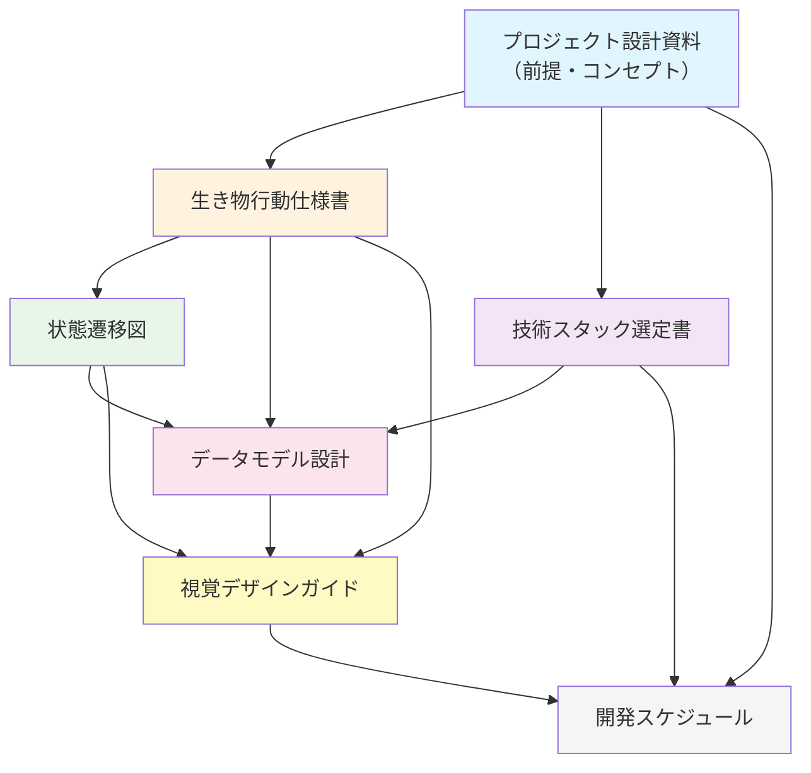

# プロジェクト設計ドキュメント全体まとめ

**境界生物 / Liminal Creature**  
作成日: 2026年4月

---

## 目次

1. [本書の位置づけ](#1-本書の位置づけ)
2. [プロジェクト概要](#2-プロジェクト概要)
3. [成果物一覧](#3-成果物一覧)
4. [設計ドキュメント間の関係](#4-設計ドキュメント間の関係)
5. [主要な設計判断のまとめ](#5-主要な設計判断のまとめ)
6. [未決定事項の集約](#6-未決定事項の集約)
7. [リスクの集約](#7-リスクの集約)
8. [次のアクション](#8-次のアクション)

---

## 1. 本書の位置づけ

本書は、2026年4月に策定した「境界生物 / Liminal Creature」プロジェクトの全設計ドキュメントを俯瞰し、相互の関係性・主要な設計判断・未決定事項を集約するものである。

開発開始前の最終確認ドキュメントとして、また開発中に「全体像を見失った時に立ち返る基準」として位置づける。

---

## 2. プロジェクト概要

### 2.1 作品コンセプト

カメラに映った体験者のシルエットの「輪郭線」から生き物が生まれる。生き物は体験者の境界に沿って動き、動きに反応し、時間とともに関係性を築く。体験者は「自分の境界が他者になる」という体験を通じて、「通じ合い」の瞬間を得る。

### 2.2 基本情報

| 項目 | 内容 |
|------|------|
| 作品名 | 境界生物 / Liminal Creature |
| 形態 | 展示会形式の体験型インタラクティブアート |
| 出力形式 | スタンドアロン .exe（Windows） |
| 開発期間 | 2026年4月中旬〜2026年7月中旬（約14週間） |
| 開発体制 | 完全一人開発 |
| 体験時間 | 約1分間 |
| 発表 | 2026年7月中旬 |

### 2.3 体験フロー（1分間）

| 時間 | フェーズ | 内容 |
|------|---------|------|
| 0-10秒 | 導入 | 自分が映る、輪郭から粒子が生まれ始める |
| 10-25秒 | 発見 | 粒子が集まり形を持ち始める、動きへの反応を発見 |
| 25-40秒 | 探索 | 様々な動きを試す、生き物の個性に気づく |
| 40-50秒 | 通じ合い | 生き物が明確に「応答」する瞬間（最重要） |
| 50-60秒 | 余韻 | 動きを止める、生き物が寄り添う |

---

## 3. 成果物一覧

本プロジェクトで策定した6つの設計ドキュメント。

| # | ドキュメント | ファイル名 | 目的 | ページ数目安 |
|---|------------|----------|------|------------|
| 1 | 生き物行動仕様書 | creature_behavior_spec_v1.2.md | 生き物の行動ルール・反応・関係性の詳細仕様 | 約45ページ |
| 2 | 状態遷移図 | state_transition_diagrams.md | 6つの状態遷移図（Mermaid）と相互関係 | 約34ページ |
| 3 | 技術スタック選定書 | tech_stack_selection_v1.2.1.md | Unity/Python/MLパイプラインの技術選定 | 約50ページ |
| 4 | データモデル設計 | data_model_design_v1.1.md + DataModelDefinitions.cs | 全データ構造の設計と C# 定義 | 約28ページ + 1,000行 |
| 5 | 視覚デザインガイド | visual_design_guide_v1.1.md | 色彩・形態・エフェクトの方針 | 約39ページ |
| 6 | 開発スケジュール | development_schedule_v2.md | 14週間計画＋拡張開発スケジュール | 約42ページ |

### 3.1 ドキュメント間の参照関係

---

## 4. 設計ドキュメント間の関係

### 4.1 各ドキュメントの責務

| ドキュメント | 責務 | カバー範囲 |
|------------|------|----------|
| 行動仕様書 | 生き物が「何をするか」 | 行動ルール、反応、関係性、通じ合い、複数人対応の方針 |
| 状態遷移図 | システム全体が「どう動くか」 | 6つの状態遷移（システム/ライフサイクル/関係性/行動優先度/越境/画面） |
| 技術スタック選定書 | 「何で作るか」 | Unity/パッケージ/MLパイプライン/開発環境/展示運用 |
| データモデル設計 | 「データをどう持つか」 | 全データ型のC#定義とインターフェース |
| 視覚デザインガイド | 「どう見せるか」 | 色彩/形態/エフェクト/シェーダー方針 |
| 開発スケジュール | 「いつ何を作るか」 | 14週間計画（本編）＋拡張29週間 |

### 4.2 ドキュメント横断のキーコンセプト

以下のコンセプトは複数ドキュメントにまたがる重要な設計概念。

| コンセプト | 主管 | 関連 |
|----------|------|------|
| 「通じ合い」 | 行動仕様書10章 | 状態遷移図STD-01・STD-03、視覚デザイン12章 |
| 関係性の4状態（Wary→Bonded） | 行動仕様書8章 | 状態遷移図STD-03、データモデル5.6、視覚デザイン11章 |
| 形態段階（Particle→Larva→Adult） | 行動仕様書4章 | 状態遷移図STD-02、データモデル5.3、視覚デザイン7〜9章 |
| 個性パラメータ（4軸） | 行動仕様書3章 | データモデル5.2、視覚デザイン9.2 |
| 寒色→暖色の色遷移 | 視覚デザイン3.2 | 行動仕様書（言及なし）、データモデルRelationshipState |
| 輪郭ベースのスポーン | 行動仕様書5章 | 視覚デザイン7章、データモデルSpawnCandidate |
| 通じ合い保証メカニズム | 行動仕様書10.4章 | 状態遷移図STD-01、データモデルConnectionState |
| Object Pool | 技術スタック11.4 | データモデルIPoolable、視覚デザイン18章 |
| ハイブリッド越境（複数人） | 行動仕様書14章 | 状態遷移図STD-05、データモデルCrossingState、視覚デザイン15.4 |

---

## 5. 主要な設計判断のまとめ

設計過程で行った重要な判断と、その根拠。

### 5.1 アーキテクチャ・技術

| 判断 | 内容 | 根拠 |
|------|------|------|
| **描画エンジン: Unity 6.3 LTS** | Unityを採用（Three.js/TouchDesigner/openFrameworks/Unrealから選定） | VFX Graph/Shader Graphの表現力、ソロ開発の効率、サポート期限 |
| **レンダリング: URP** | HDRPではなくURP | 8GB GPU制約下でのパフォーマンス |
| **AI推論: Inference Engine** | MediaPipe Plugin（CPU）と並行検証だがメインはInference Engine（GPU） | GPU推論によるパフォーマンス、Unity内完結 |
| **C#アーキテクチャ: 4層 + 手動DI** | DIコンテナ等は導入せず、手動DI | 一人開発の現実、過剰設計の回避 |
| **非同期: UniTask** | Coroutineより型安全 | 推論結果待ち等の非同期処理の安全性 |
| **Burst + Job**: 限定適用 | Boids/輪郭解析/動き特徴量のみJob化 | 個体数が少ないものはオーバーヘッドが勝る |

### 5.2 体験設計

| 判断 | 内容 | 根拠 |
|------|------|------|
| **通じ合い保証メカニズム** | 30秒で軽ブースト、40秒で強ブースト、48秒で強制発動 | 1分間で必ず通じ合いに到達させる体験設計 |
| **対象者切替: 引き継ぎ方式** | 全リセットではなく、関係性スコア×0.8で引き継ぐ | 展示全体を通じて生き物が「育つ」感覚を演出 |
| **方向性表現: 抽象** | 「目」を持たせず、形状・発光・軌跡で方向を示唆 | コンセプトの抽象性維持 |
| **背景: カメラ映像をそのまま** | フィルタなし | 「現実と幻想の境界」というコンセプト |
| **音響: スコープ外** | 14週間版では音響を実装しない | 視覚優先。拡張フェーズExEで対応 |
| **複数人対応: 拡張フェーズ** | 1人版を完成させてからExFで対応 | 14週間で1人版すら挑戦的 |

### 5.3 視覚表現

| 判断 | 内容 | 根拠 |
|------|------|------|
| **合成モード: Additive** | 全エフェクトを加算合成 | カメラ映像に対して光を「足す」ことで明るい環境でも沈まない |
| **色遷移: HSV空間補間** | RGB直接補間ではなくHSV | 中間色のくすみ防止 |
| **色覚配慮: 多重チャネル** | 色だけでなく輝度・サイズ・脈動速度・動きで状態を伝える | カラーユニバーサルデザイン |
| **明るい背景対策: 段階的明度抑制** | 照度に応じて80%/60%にカメラ映像を抑制 | Additiveの視認性確保 |
| **シルエット: エッジのみ発光** | 内部塗りつぶしなし | 体験者本体はカメラ映像、シルエットは「場」 |

### 5.4 開発・運用

| 判断 | 内容 | 根拠 |
|------|------|------|
| **発表日 = 2026年7月中旬** | 開発期間14週間 | プロジェクト前提 |
| **3段階レベル設定（Bronze/Silver/Gold）** | 進捗に応じて目標を切替 | Unity初心者で14週間という制約への対応 |
| **学習と実装の並行** | チュートリアルは最大2日に圧縮 | 時間的制約 |
| **モデル選定: 即決方針** | 「最初に動いたもので最後まで行く」 | 比較検証の時間がない |
| **ファインチューニング: スコープ外** | ExCで実施 | 14週間では時間が足りない |
| **設定: JSON外部化＋ホットリロード** | settings.jsonでパラメータ調整 | 展示現場での調整必要性（NF-501） |
| **自動復帰: ウォッチドッグ** | watchdog.batでクラッシュ時自動再起動 | 8時間連続稼働の安全弁 |

### 5.5 重要な変更履歴

| 時点 | 変更内容 | 影響 |
|------|---------|------|
| 行動仕様書 v1.0→v1.1 | MECEレビューによる多数の補完 | 設計の網羅性向上 |
| 行動仕様書 v1.1→v1.2 | 抽象形態確定、対象者切替を引き継ぎ方式に、複数人対応追加 | コンセプト・拡張性の確定 |
| 状態遷移図 v1.0→v1.1 | パフォーマンス低下遷移、形態段階分岐等の追加 | 異常系のカバー |
| 技術スタック v1.0→v1.1 | カメラ入力・輪郭抽出・推論パイプライン詳細化 | 実装可能性の確保 |
| 技術スタック v1.1→v1.2 | ランタイム/開発時の分離、Pythonパイプライン追加 | ファインチューニング対応 |
| 技術スタック v1.2→v1.2.1 | 展示運用フロー対応（ビルド・キャリブレーション・自動復帰） | 展示準備の網羅性 |
| データモデル v1.0→v1.1 | パーティクル管理境界明確化、ダブルバッファリング、補助型追加 | 実装の安全性向上 |
| 視覚デザイン v1.0→v1.1 | 待機画面・明るい背景対策・色覚配慮・対象者切替演出 | 体験品質の網羅 |
| 開発スケジュール v1.0→v2.0 | 発表日修正（2027年→2026年）、14週間計画に全面書き直し | 計画の現実性確保 |

---

## 6. 未決定事項の集約

各ドキュメントで「未決定」とされている事項を一覧化。実装中に判断する。

### 6.1 視覚表現

| 項目 | 候補 | 決定タイミング | 主管ドキュメント |
|------|------|-------------|--------------|
| 方向性表現の最適手法 | A.形状伸長 / B.発光偏り / C.軌跡 / D.脈動伝播 | プロトタイプ検証後 | 視覚デザイン10章 |
| 成体の描画方式 | A.単一Quad+SDF / B.複数Quad構成 | プロトタイプ検証後 | 視覚デザイン9.1 |
| カメラ映像の明度抑制 | なし / 70% / 暗い部分のみ | 展示環境テスト後 | 視覚デザイン5.4 |
| シルエットエッジのブラーサイズ | 3×3 / 5×5 | プロトタイプ検証後 | 視覚デザイン6章 |
| 環境パーティクルの密度 | 50〜100個 | ユーザーテスト後 | 視覚デザイン5.2 |
| 通じ合い演出の光の粒数 | 10〜30個 | プロトタイプ検証後 | 視覚デザイン12章 |
| Bloom強度 | Intensity 0.8〜1.2 | 展示環境テスト後 | 視覚デザイン14.1 |

### 6.2 技術・実装

| 項目 | 候補 | 決定タイミング | 主管ドキュメント |
|------|------|-------------|--------------|
| 最終セグメンテーションモデル | MediaPipe / BodyPix / MODNet | フェーズ1〜2で即決 | 技術スタック7章 |
| 同期検出のアルゴリズム | FFT / ピーク間隔 | プロトタイプ検証後（拡張フェーズ） | 行動仕様書7.3 |
| 輪郭ジャンプ閾値 | 画面幅の20%（暫定） | MediaPipe実機テスト後 | 行動仕様書12.2 |
| フリッカー閾値 | 0.5秒（暫定） | 展示環境テスト後 | 行動仕様書12.1 |
| パーティクルのタイムアウト | 10秒（暫定） | プロトタイプ検証後 | 行動仕様書17.1 |

### 6.3 体験設計

| 項目 | 候補 | 決定タイミング | 主管ドキュメント |
|------|------|-------------|--------------|
| 対象者切替時のスコア減衰率 | 0.8（暫定） | ユーザーテスト後 | 行動仕様書17.1 |
| 複数人時の境界開放距離 | 100px（暫定） | 拡張フェーズExFで検証 | 行動仕様書17.1 |
| 越境した生き物の帰巣タイミング | 即帰巣 / 滞在猶予あり | ユーザーテスト後 | 行動仕様書17.1 |
| 長時間展示での自動リセット条件 | 手動のみ / N人連続後に自動 | 展示リハーサル後 | 行動仕様書17.1 |

### 6.4 拡張範囲

| 項目 | 状態 | 決定タイミング |
|------|------|-------------|
| 音響の有無 | スコープ外（ExEで対応） | 拡張フェーズ着手時 |
| 痕跡システムの詳細 | スコープ外（ExGで対応） | 拡張フェーズ着手時 |
| AI形態生成（ID 207） | 任意要件、保留 | 必要性判断後 |
| 学習・記憶機能（ID 311） | 任意要件、保留 | 必要性判断後 |

---

## 7. リスクの集約

各ドキュメントで挙げられたリスクを優先度順に集約。

### 7.1 高リスク（プロジェクト成否に直結）

| リスク | 影響 | 対応策 | 主管 |
|--------|------|--------|------|
| Unity学習の遅れ | 全フェーズが遅延 | チュートリアル時間圧縮、AIアシスタント活用 | スケジュール12 |
| MediaPipeがUnity 6.3で動作しない | 入力パイプライン構築不可 | BodyPixSentisに即切替、Unity 2022 LTSダウングレードも検討 | スケジュール12.1 |
| セグメンテーション精度不足 | コア体験が成立しない | 段階的フォールバック（Level 1〜5）、平滑化強度引き上げ | 技術スタック20.2 |
| 8時間連続稼働でクラッシュ | 展示が中断 | Object Pool徹底、Profilerで定期計測、ウォッチドッグスクリプト | 技術スタック14.4 |

### 7.2 中リスク（品質に影響）

| リスク | 影響 | 対応策 | 主管 |
|--------|------|--------|------|
| 会場照明との相性 | 検出不安定 | キャリブレーション機能、プリセット切替、現地テスト | 技術スタック14.3 |
| GPU 8GBで容量不足 | フレームレート低下 | モデル量子化、VFX品質の動的調整 | 技術スタック14.2 |
| VFX Graphの習熟不足 | 視覚表現が想定以下 | 成体をパーティクル集合に簡略化、ParticleSystem代替 | スケジュール12 |
| 通じ合い演出のタイミング調整困難 | 体験の感動が薄い | パラメータのホットリロードで反復調整 | スケジュール12 |

### 7.3 低リスク（運用面）

| リスク | 影響 | 対応策 | 主管 |
|--------|------|--------|------|
| ファインチューニング用データ不足 | モデル精度上がらず | 公開データセット併用、データ拡張 | 技術スタック20.1 |
| 展示環境が想定と大きく異なる | キャリブレーションが効かない | ファインチューニング再実施（ExC） | スケジュール12 |
| 複数人時のパフォーマンス | 2人で60fps維持できない | 描画負荷を人数按分、推論頻度調整 | 技術スタック20.1 |

---

## 8. 次のアクション

### 8.1 開発開始（W1）に向けた即時アクション

| アクション | 期限 | 備考 |
|----------|------|------|
| Unity 6.3 LTSのインストール | W1初日 | Unity Hub経由 |
| プロジェクト作成、Git初期化 | W1初日 | フォルダ構成は技術スタック11.3参照 |
| Git LFS設定 | W1初日 | VFX/モデルファイル用 |
| Unity Learn: Roll-a-Ball完了 | W1の1〜2日 | Unity基本操作の習得 |
| MediaPipe Unity Pluginの動作確認 | W2前半 | フォールバック判断の早期実施 |
| settings.json雛形作成 | W3 | データモデル設計 8章のConfig構造に基づく |

### 8.2 設計ドキュメントの今後

| 状態 | ドキュメント |
|------|------------|
| 凍結（変更しない） | 6つの設計ドキュメント全て |
| 例外的に更新する場合 | 重大な設計判断変更が発生した場合のみ。バージョンを上げて履歴を残す |
| 実装中の参照 | settings.jsonの初期値はデータモデル8章、視覚パラメータは視覚デザイン各章 |
| 拡張フェーズ着手時 | 設計ドキュメントを再読し、未実装機能の詳細仕様を確認 |

### 8.3 進捗管理

| 方法 | 詳細 |
|------|------|
| 日次ログ | 1行で作業内容と時間を記録 |
| 週末レビュー | 30分。週次の実績 vs 計画 |
| マイルストーンレビュー | M1/M2/M3到達時に半日の振り返り |
| デモ動画 | 月1回の撮影でモチベーション維持 |

### 8.4 拡張開発（展示後）の判断

展示完了後、以下を評価して拡張開発の方針を決定する:

- 展示で得られたフィードバック
- 次の発表機会の有無と時期
- 開発継続のモチベーション
- 完成度に対する自己評価

拡張順序の推奨は **ExA（行動深化）→ ExD（運用品質）→ ExB（視覚強化）→ ExC（ML精度）→ ExE（音響）→ ExG（痕跡）→ ExF（複数人）**（スケジュール22.1参照）。

---

## 付録: ドキュメント参照ガイド

開発中に「何を見るべきか」の早見表。

### A.1 「○○の値はいくつ？」

→ **データモデル設計 8章** または各設定型のデフォルト値、もしくは**行動仕様書 16章 パラメータ一覧**

### A.2 「この機能はどう動く？」

→ **行動仕様書 4〜11章** のうち該当章

### A.3 「この状態の遷移条件は？」

→ **状態遷移図 STD-01〜STD-06**

### A.4 「このデータ型はどんな構造？」

→ **DataModelDefinitions.cs** の該当namespace

### A.5 「どう見せる？色は？」

→ **視覚デザインガイド 3章（色）、9章（成体）、12章（通じ合い）**

### A.6 「Unity でどう実装する？」

→ **技術スタック選定書 11章（C#方針）、19章は各機能の参照箇所**、**視覚デザインガイド 19章（VFX/Shader実装）**

### A.7 「いつまでに何を作る？」

→ **開発スケジュール 5〜9章**（本編）、**14〜21章**（拡張）

### A.8 「展示当日の準備手順は？」

→ **技術スタック選定書 14.3章（キャリブレーション）、15.4章（リリースチェックリスト）**

---

*以上*
