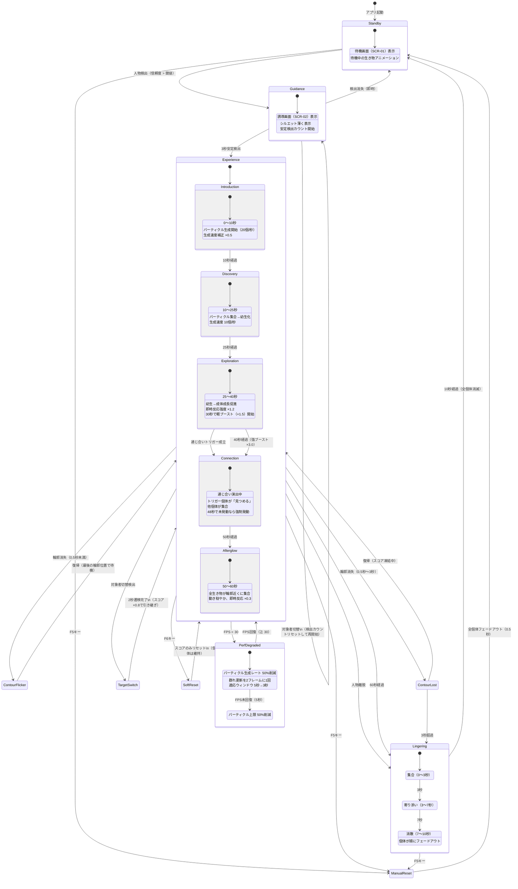
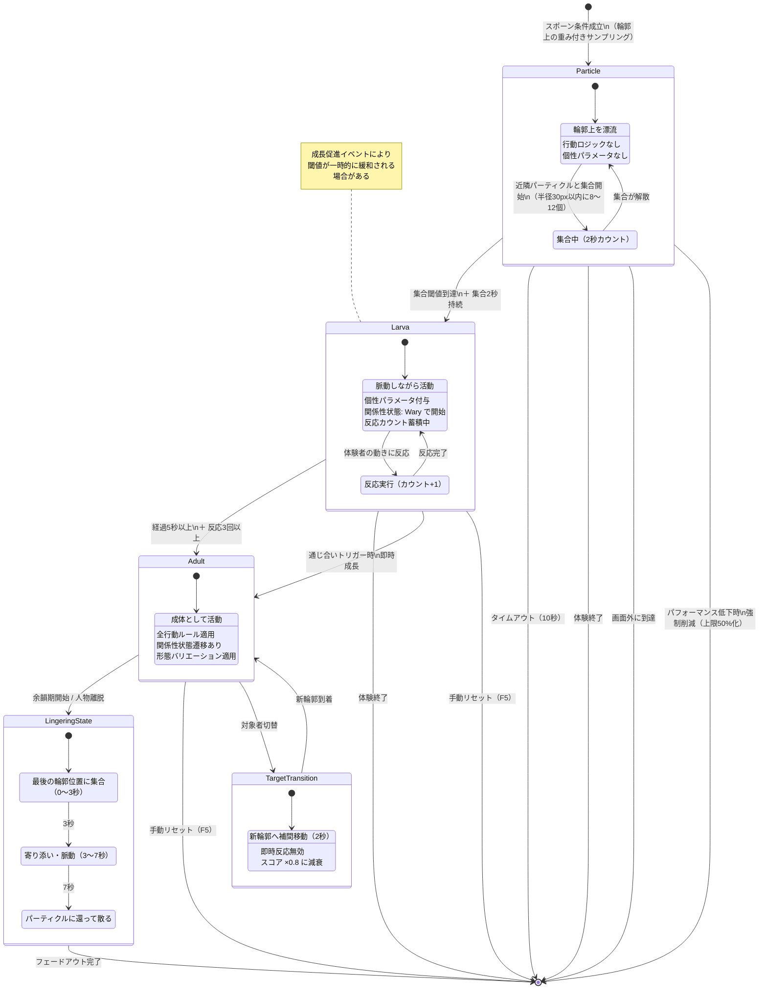
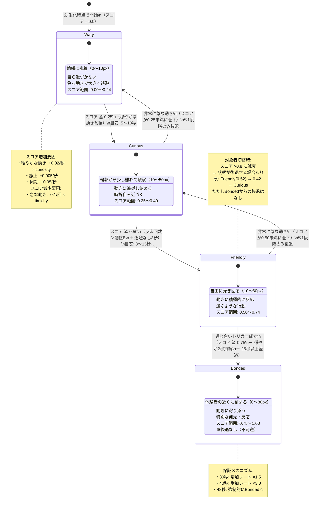
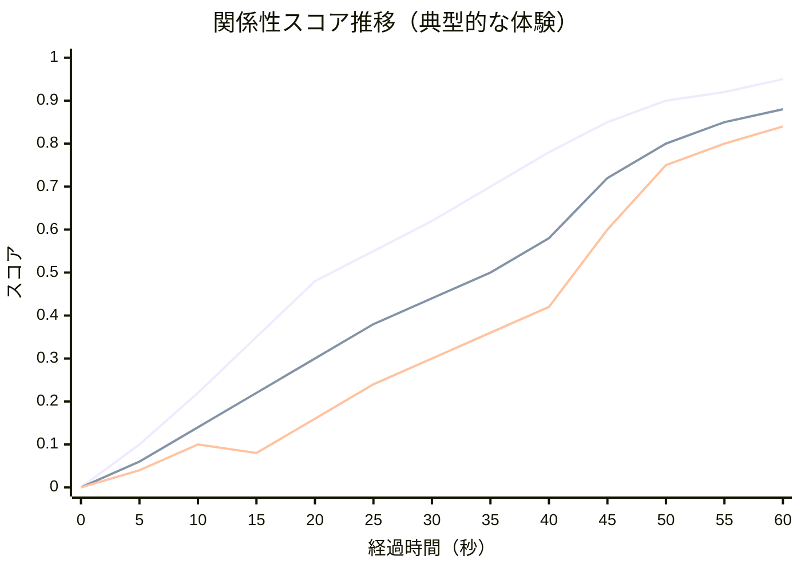
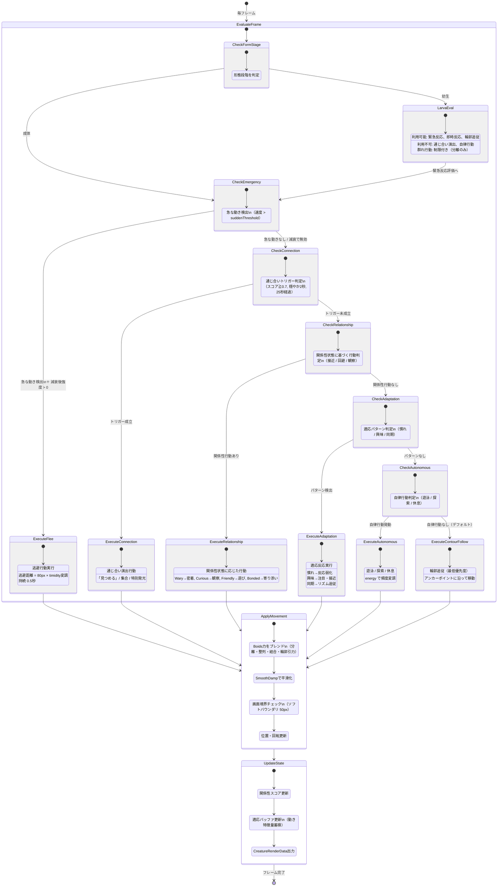
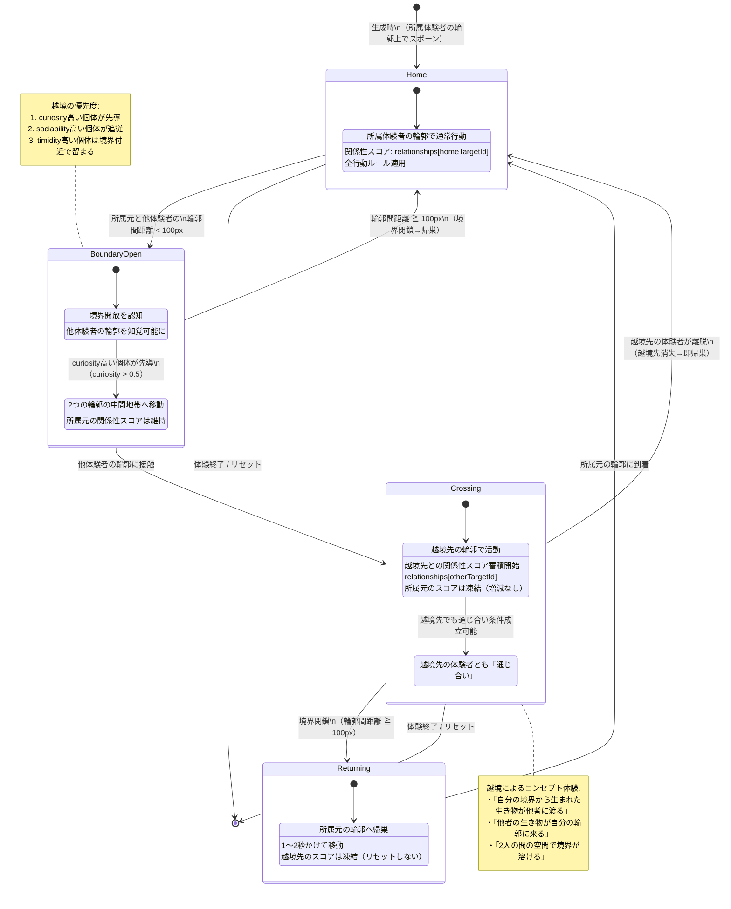
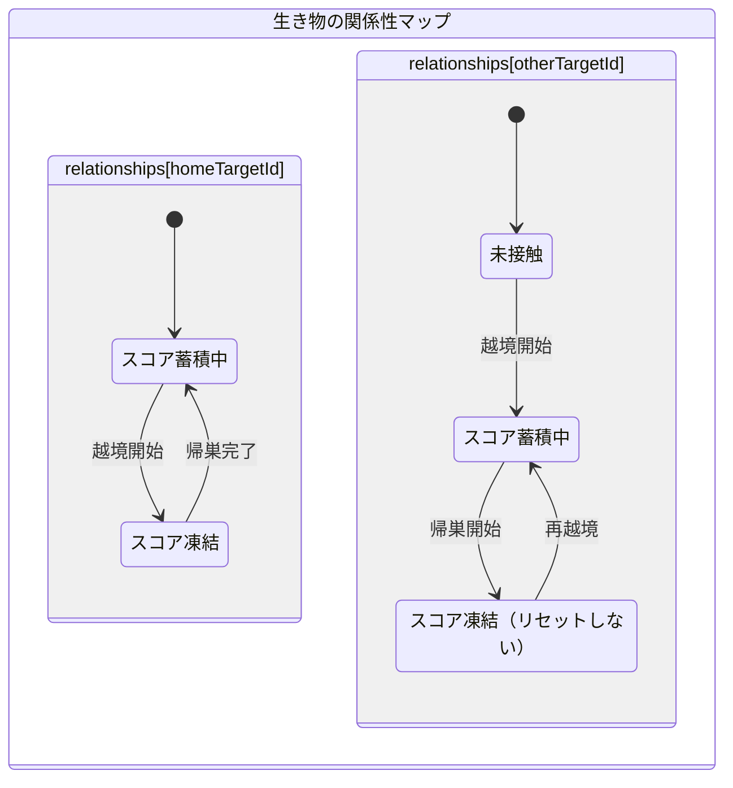
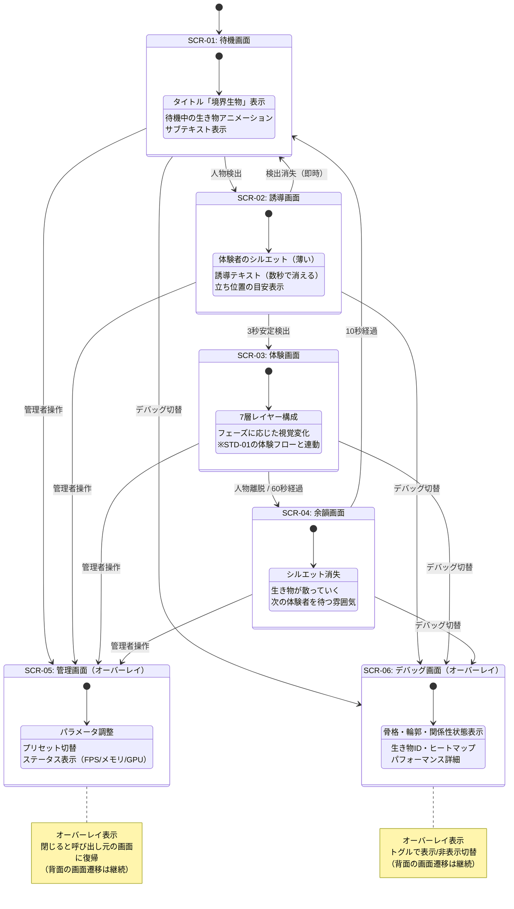
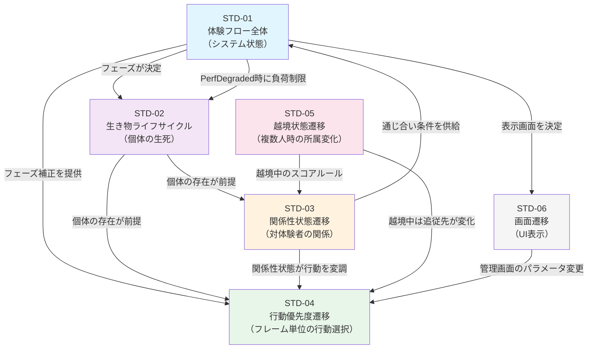

# 状態遷移図

**境界生物 / Liminal Creature**  
バージョン: 1.1 ｜ 作成日: 2026年4月  
変更履歴: v1.0→v1.1 MECEレビュー反映（パフォーマンス低下遷移、形態段階分岐、凡例、画面遷移修正等）

---

## 目次

1. [本書の位置づけ](#1-本書の位置づけ)
2. [図の一覧](#2-図の一覧)
   - 2.1 [凡例](#21-凡例)
   - 2.2 [互換性に関する注記](#22-互換性に関する注記)
3. [STD-01: 体験フロー全体](#3-std-01-体験フロー全体)
4. [STD-02: 生き物ライフサイクル](#4-std-02-生き物ライフサイクル)
5. [STD-03: 関係性状態遷移](#5-std-03-関係性状態遷移)
6. [STD-04: 行動優先度遷移](#6-std-04-行動優先度遷移)
7. [STD-05: 越境状態遷移（複数人対応）](#7-std-05-越境状態遷移複数人対応)
8. [STD-06: 画面遷移](#8-std-06-画面遷移)
9. [図間の関係](#9-図間の関係)

---

## 1. 本書の位置づけ

本書は、プロジェクト設計資料「今後の成果物」における成果物2「状態遷移図」に相当する。

生き物行動仕様書（v1.2）の15章に含まれるMermaid図を正式版として清書・拡充し、新規に行動優先度遷移（STD-04）および越境状態遷移（STD-05）を追加したものである。

### 参照ドキュメント

| ドキュメント | 参照箇所 |
|------------|---------|
| プロジェクト設計資料 | 3章（コンセプト）、6章（画面設計）、7章（アーキテクチャ） |
| 生き物行動仕様書 v1.2 | 全章（本書の各図と対応章を図ごとに明記） |

---

## 2. 図の一覧

| 図ID | 図名 | 対象 | 行動仕様書との対応 |
|------|------|------|-----------------|
| STD-01 | 体験フロー全体 | システム全体の状態遷移 | 9章（体験フェーズ連動）、12章（異常系） |
| STD-02 | 生き物ライフサイクル | 個体の生成〜消滅 | 2章（基本定義）、4章（形態と成長） |
| STD-03 | 関係性状態遷移 | 体験者との関係性の変化 | 8章（関係性状態遷移）、10章（通じ合い判定） |
| STD-04 | 行動優先度遷移 | フレームごとの行動選択フロー | 6章（行動ルール）、7章（反応システム） |
| STD-05 | 越境状態遷移 | 複数人時の生き物の所属変化 | 14章（複数人対応拡張方針） |
| STD-06 | 画面遷移 | UI画面間の遷移 | プロジェクト設計資料6章（画面設計） |

---

### 2.1 凡例

本書の状態遷移図は以下の表記規則に従う。

| 表記 | 意味 |
|------|------|
| `[*] -->` | 初期遷移（開始点からの進入） |
| `A --> B : ラベル` | 状態Aから状態Bへの遷移。ラベルは遷移条件 |
| `A --> A : ラベル` | 自己遷移（同じ状態に留まるが内部処理が発生） |
| `state A { ... }` | 複合状態（内部に子状態を持つ） |
| `note` | 補足説明（遷移条件の詳細や設計意図） |
| `\n` | ラベル内の改行（条件が複数ある場合） |

遷移ラベルの形式: `トリガー条件（補足パラメータ）`

### 2.2 互換性に関する注記

- 本書のMermaid図はMermaid v10以降を前提とする
- STD-03内のスコア推移グラフ（`xychart-beta`）はMermaid v10.6以降で対応。未対応レンダラーではテキスト表示になる。その場合は5.3の表を参照のこと

---

## 3. STD-01: 体験フロー全体

システム起動から体験の開始・進行・終了・リセットまでの全体フローを定義する。

### 3.1 遷移図

### 3.2 状態説明

| 状態 | 説明 | 進入条件 | 退出条件 |
|------|------|---------|---------|
| Standby | 待機。人物を待つ | アプリ起動 / 余韻終了 / リセット | 人物検出 |
| Guidance | 誘導。立ち位置を案内 | 人物検出 | 安定検出3秒 / 検出消失 |
| Introduction | 導入期。パーティクル生成 | 誘導完了 | 10秒経過 |
| Discovery | 発見期。幼生化 | 10秒経過 | 25秒経過 |
| Exploration | 探索期。成体化・反応探索 | 25秒経過 | 通じ合いトリガー / 40秒 |
| Connection | 通じ合い期。最重要瞬間 | トリガー成立 | 50秒経過 |
| Afterglow | 余韻期。穏やかな集合 | 50秒経過 | 60秒経過 / 人物離脱 |
| Lingering | 退場余韻。生き物が散る | 体験終了 | 10秒経過 |
| ContourFlicker | 輪郭短時間消失 | 0.5秒未満の消失 | 復帰 / 0.5秒超過 |
| ContourLost | 輪郭中時間消失 | 0.5秒〜3秒の消失 | 復帰 / 3秒超過 |
| TargetSwitch | 対象者切替中 | 対象者変更検出 | 2秒遷移完了 |
| ManualReset | 手動リセット | F5キー | フェードアウト完了 |
| SoftReset | ソフトリセット | F6キー | 即時（スコアリセットのみ） |
| PerfDegraded | パフォーマンス低下中 | FPS＜30 | FPS回復（≧30） |

> **補足**: Guidance中に対象者が切り替わった場合（別の人が前に立つ等）、安定検出カウントをリセットして再計測する。体験は開始されない。

---

## 4. STD-02: 生き物ライフサイクル

個々の生き物（パーティクル→幼生→成体）の状態遷移を定義する。

### 4.1 遷移図

### 4.2 状態説明

| 状態 | 描画負荷単位 | 行動ロジック | 個性 | 関係性 |
|------|------------|------------|------|--------|
| Particle/Drifting | 1 | なし（VFX制御） | なし | なし |
| Particle/Clustering | 1 | なし（物理演算のみ） | なし | なし |
| Larva | 5 | 基本移動・即時反応 | あり | Waryで開始 |
| Adult | 10 | 全行動ルール | あり | 4状態遷移 |
| LingeringState | 10→0 | 余韻専用行動 | 維持 | 凍結 |
| TargetTransition | 10 | 補間移動のみ | 維持 | 減衰 |

---

## 5. STD-03: 関係性状態遷移

体験者と個々の生き物の間の関係性変化を定義する。幼生化時点で開始し、成体まで継続する。

### 5.1 遷移図

### 5.2 遷移条件の詳細

| 遷移 | スコア条件 | 追加条件 | 個性の影響 |
|------|----------|---------|----------|
| Wary→Curious | ≧ 0.25 | なし | curiosity高 → 増加レート ×1.5 |
| Curious→Friendly | ≧ 0.50 | 反応回数＞閾値B、逃避なし3秒 | — |
| Friendly→Bonded | ≧ 0.75 | 通じ合いトリガー全条件（10章参照） | curiosity高 → 先行到達 |
| Curious→Wary | ＜ 0.25 | 急な動き発生 | timidity高 → 減少 ×1.5 |
| Friendly→Curious | ＜ 0.50 | 急な動き発生 | timidity高 → 減少 ×1.5 |
| Bonded→（なし） | — | 後退不可 | — |

### 5.3 スコア推移シミュレーション（典型パターン）

> 上図は理想的な体験を想定したシミュレーション。臆病な個体は15秒付近で急な動きにより一時後退する例を含む。30秒以降は保証メカニズムのブーストにより全個体がBondedに到達。

#### xychart未対応環境向けテーブル

| 秒 | 好奇心高 | 標準 | 臆病 | フェーズ | 備考 |
|----|---------|------|------|---------|------|
| 0 | 0.00 | 0.00 | 0.00 | 導入 | 全個体Wary |
| 10 | 0.22 | 0.14 | 0.10 | 発見 | — |
| 15 | 0.35 | 0.22 | 0.08 | 発見 | 臆病個体が急な動きで後退 |
| 25 | 0.48→**Curious** | 0.30→**Curious** | 0.24 | 探索開始 | 好奇心高・標準がCuriousに |
| 30 | 0.55 | 0.38 | 0.30→**Curious** | 探索 | 軽ブースト(×1.5)開始 |
| 40 | 0.70 | 0.50→**Friendly** | 0.42 | 通じ合い期 | 強ブースト(×3.0)開始 |
| 45 | 0.78→**Bonded** | 0.72 | 0.60→**Friendly** | 通じ合い期 | 好奇心高が通じ合い到達 |
| 50 | 0.90 | 0.80→**Bonded** | 0.75→**Bonded** | 余韻 | 全個体Bonded |

---

## 6. STD-04: 行動優先度遷移

各フレームにおける行動選択のフローを定義する。生き物（幼生・成体）ごとに毎フレーム評価される。

### 6.1 遷移図（フレーム単位の評価フロー）

### 6.2 優先度のまとめ

| 優先度 | 行動 | 評価順 | 割り込み可否 | 幼生 | 成体 |
|--------|------|--------|------------|------|------|
| 1（最高） | 緊急反応（逃避） | 最初に評価 | 全行動を中断して実行 | ○ | ○ |
| 2 | 通じ合い演出 | 緊急なしの場合 | 関係性以下を上書き | × | ○ |
| 3 | 関係性行動 | 通じ合いなしの場合 | 適応以下を上書き | △（接近/回避のみ） | ○ |
| 4 | 適応反応 | 関係性行動なしの場合 | 自律以下を上書き | ○ | ○ |
| 5 | 自律行動 | 適応なしの場合 | 輪郭追従を上書き | × | ○ |
| 6（最低） | 輪郭追従 | 他の行動がない場合 | デフォルト | ○ | ○ |

> すべての行動出力は ApplyMovement でBoids力とブレンドされ、SmoothDampで平滑化される。このため、行動の切り替わりは滑らかに見える。

---

## 7. STD-05: 越境状態遷移（複数人対応）

複数人の体験者がいる場合の、生き物の所属と越境の状態遷移を定義する。フェーズ2（1人版安定後）で実装予定。

> **適用条件**: 本図はSTD-01がExperience状態にあるときのみアクティブ。Standby/Guidance/Lingering中は越境ロジックは評価されない。

### 7.1 遷移図

### 7.2 越境時の関係性データ

### 7.3 状態説明

| 状態 | 所属 | 追従先 | スコア計算 |
|------|------|--------|----------|
| Home | 元の体験者 | 元の体験者 | homeスコア蓄積中 |
| BoundaryOpen/Aware | 元の体験者 | 元の体験者 | homeスコア蓄積中 |
| BoundaryOpen/Approaching | 元の体験者 | 中間地帯 | homeスコア維持 |
| Crossing | 元の体験者（変わらない） | 越境先の体験者 | otherスコア蓄積中、homeスコア凍結 |
| Returning | 元の体験者 | 元の体験者（帰巣中） | 両スコア凍結 |

---

## 8. STD-06: 画面遷移

UI画面間の遷移を定義する。プロジェクト設計資料6.9の画面遷移を正式図として清書。

### 8.1 遷移図

> **補足**: SCR-05/SCR-06はオーバーレイのため、背面の画面（SCR-01〜04）の状態遷移は影響を受けない。閉じた場合はオーバーレイが消えるだけで、呼び出し元の画面がそのまま表示される。Mermaid上は遷移先を省略しているが、実装上は「元画面に復帰」となる。

### 8.2 画面とシステム状態の対応

| 画面 | 対応するシステム状態（STD-01） | 表示レイヤー |
|------|---------------------------|------------|
| SCR-01 | Standby | 背景＋待機アニメ |
| SCR-02 | Guidance | 背景＋シルエット＋誘導テキスト |
| SCR-03 | Experience全フェーズ | 7層フルレンダリング |
| SCR-04 | Lingering | 背景＋生き物（フェードアウト中） |
| SCR-05 | 任意（オーバーレイ） | 元画面の上にパネル |
| SCR-06 | 任意（オーバーレイ） | 元画面の上にデバッグ情報 |

---

## 9. 図間の関係

各図がカバーする範囲と相互の依存関係を示す。

### 依存関係の読み方

| 関係 | 説明 |
|------|------|
| STD-01 → STD-02 | 体験フェーズが生き物の生成・成長速度を制御する |
| STD-01 → STD-02（PerfDegraded） | パフォーマンス低下時にパーティクル強制削減を指示する |
| STD-01 → STD-04 | フェーズ別パラメータ補正が行動優先度の評価に影響する |
| STD-01 → STD-06 | システム状態がどの画面を表示するかを決定する |
| STD-02 → STD-03 | 関係性は幼生以降の個体にのみ存在する |
| STD-02 → STD-04 | 行動ロジックは幼生・成体にのみ適用される。形態段階で利用可能な行動が異なる |
| STD-03 → STD-04 | 関係性状態（Wary/Curious/Friendly/Bonded）が行動パターンを変調する |
| STD-03 → STD-01 | 通じ合いトリガーが体験フローのフェーズ遷移を駆動する |
| STD-05 → STD-04 | 越境中は追従先の輪郭が変わり、行動の基準点が変化する |
| STD-05 → STD-03 | 越境中は越境先の体験者に対する関係性スコアが蓄積される |
| STD-06 → STD-04 | 管理画面（SCR-05）でのパラメータ変更が行動パラメータに即時反映される |

---

*以上*
